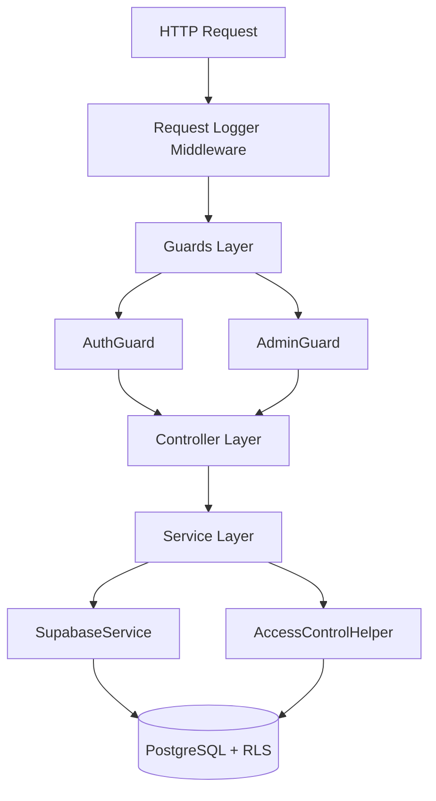

# Backend Architecture

> Status: Production-ready  
> Stack: NestJS, TypeScript, Supabase, PostgreSQL  
> Related Docs: [Database Architecture](./database-architecture.md), [Authentication](./authentication-authorization.md)

## Overview & Key Concepts

The backend is built on **NestJS**, following a modular architecture with dependency injection, guards, middleware, and centralized access control patterns.

### Key Patterns

- **Module-Based Architecture**: Feature modules with clear boundaries
- **Dependency Injection**: Loose coupling via NestJS DI container
- **Guards**: Request-level authorization (AuthGuard, AdminGuard)
- **AccessControlHelper**: Centralized permission verification
- **SupabaseService**: Context-aware client management
- **Service Layer**: Business logic separation from controllers

### Architecture Layers



## Implementation Details

### Directory Structure

```
backend/src/
├── app.module.ts                 # Root module
├── main.ts                       # Application bootstrap
├── common/
│   ├── guards/
│   │   ├── auth.guard.ts         # JWT validation + status check
│   │   └── admin.guard.ts        # Super admin verification
│   ├── helpers/
│   │   └── access-control.helper.ts  # Permission verification
│   └── middleware/
│       └── request-logger.middleware.ts
├── supabase/
│   ├── supabase.module.ts
│   └── supabase.service.ts       # Client management
├── auth/
│   ├── auth.module.ts
│   ├── auth.controller.ts
│   ├── auth.service.ts
│   └── dto/
│       └── auth.dto.ts
├── users/
│   ├── users.module.ts
│   ├── users.controller.ts
│   ├── users.service.ts
│   └── admin-users.controller.ts
├── accounts/
│   ├── accounts.module.ts
│   ├── accounts.controller.ts
│   ├── accounts.service.ts
│   └── admin-accounts.controller.ts
├── projects/
│   ├── projects.module.ts
│   ├── projects.controller.ts
│   ├── projects.service.ts
│   └── admin-projects.controller.ts
├── teams/
│   ├── teams.module.ts
│   ├── teams.controller.ts
│   └── teams.service.ts
├── plans/
│   ├── plans.module.ts
│   ├── plans.controller.ts
│   └── plans.service.ts
├── subscriptions/
│   ├── subscriptions.module.ts
│   ├── subscriptions.controller.ts
│   └── subscriptions.service.ts
├── search/
│   ├── search.module.ts
│   ├── search.controller.ts
│   └── search.service.ts
├── ai-assistant/
│   ├── ai-assistant.module.ts
│   ├── ai-assistant.controller.ts
│   ├── ai-assistant.service.ts
│   ├── services/
│   │   └── embedding.service.ts
│   └── tools/
│       └── sql-tool.ts
└── system-settings/
    ├── system-settings.module.ts
    ├── system-settings.controller.ts
    └── system-settings.service.ts
```

### Core Components

#### 1. SupabaseService

**Purpose**: Manage Supabase client instances with proper context (user JWT vs admin).

```typescript
@Injectable()
export class SupabaseService {
  private supabaseUrl: string;
  private supabaseKey: string;
  private supabaseServiceRoleKey: string;

  constructor(private readonly configService: ConfigService) {
    this.supabaseUrl = this.configService.get<string>('SUPABASE_URL');
    this.supabaseKey = this.configService.get<string>('SUPABASE_KEY');
    this.supabaseServiceRoleKey = this.configService.get<string>('SUPABASE_SERVICE_ROLE_KEY');
  }

  /**
   * Get client with user's JWT (respects RLS)
   */
  getClient(accessToken?: string): SupabaseClient {
    if (accessToken) {
      return createClient(this.supabaseUrl, this.supabaseKey, {
        global: {
          headers: {
            Authorization: `Bearer ${accessToken}`,
          },
        },
      });
    }
    return createClient(this.supabaseUrl, this.supabaseKey);
  }

  /**
   * Get admin client (bypasses RLS)
   */
  getAdminClient(): SupabaseClient {
    return createClient(this.supabaseUrl, this.supabaseServiceRoleKey);
  }

  /**
   * Get auth client with user's JWT
   */
  getAuthClient(accessToken: string): SupabaseClient {
    return createClient(this.supabaseUrl, this.supabaseKey, {
      global: {
        headers: {
          Authorization: `Bearer ${accessToken}`,
        },
      },
    });
  }
}
```

**Usage Patterns:**
```typescript
// User operations (RLS enforced)
const supabase = this.supabaseService.getClient(accessToken);
const { data } = await supabase.from('projects').select('*');

// Admin operations (RLS bypassed)
const admin = this.supabaseService.getAdminClient();
const { data } = await admin.from('users').select('*');

// Auth operations
const authClient = this.supabaseService.getAuthClient(accessToken);
const { data: { user } } = await authClient.auth.getUser();
```

#### 2. AccessControlHelper

**Purpose**: Centralized permission verification to avoid duplicating access checks.

```typescript
@Injectable()
export class AccessControlHelper {
  /**
   * Verify user belongs to account with optional role check
   */
  async verifyAccountAccess(
    supabase: SupabaseClient,
    accountId: string,
    userId: string,
    requiredRoles: string[] = []
  ) {
    const { data, error } = await supabase
      .from('account_users')
      .select('role')
      .eq('account_id', accountId)
      .eq('user_id', userId)
      .single();

    if (error || !data) {
      throw new ForbiddenException('Access denied to this account');
    }

    if (requiredRoles.length > 0 && !requiredRoles.includes(data.role)) {
      throw new ForbiddenException(
        `Requires one of: ${requiredRoles.join(', ')}`
      );
    }

    return data;
  }

  /**
   * Verify user has access to project
   */
  async verifyProjectAccess(
    supabase: SupabaseClient,
    projectId: string,
    userId: string
  ) {
    // Get project's account
    const { data: project, error } = await supabase
      .from('projects')
      .select('account_id')
      .eq('id', projectId)
      .single();

    if (error || !project) {
      throw new NotFoundException('Project not found');
    }

    // Verify account access
    await this.verifyAccountAccess(supabase, project.account_id, userId);

    return { accountId: project.account_id };
  }
}
```

**Usage in Services:**
```typescript
@Injectable()
export class ProjectsService {
  constructor(
    private readonly supabaseService: SupabaseService,
    private readonly accessControlHelper: AccessControlHelper,
  ) {}

  async getProject(projectId: string, userId: string, accessToken: string) {
    const supabase = this.supabaseService.getClient(accessToken);

    // Verify access
    await this.accessControlHelper.verifyProjectAccess(
      supabase,
      projectId,
      userId
    );

    // Fetch project (RLS provides second layer)
    const { data } = await supabase
      .from('projects')
      .select('*')
      .eq('id', projectId)
      .single();

    return data;
  }
}
```

#### 3. Module Pattern

**Standard Module Structure:**
```typescript
@Module({
  imports: [
    SupabaseModule,      // Import shared modules
    CommonModule,
  ],
  controllers: [
    ProjectsController,   // User endpoints
    AdminProjectsController,  // Admin endpoints
  ],
  providers: [
    ProjectsService,      // Business logic
    AccessControlHelper,  // Shared helper
  ],
  exports: [
    ProjectsService,      // Export for other modules
  ],
})
export class ProjectsModule {}
```

#### 4. Controller Pattern

**Standard Controller:**
```typescript
@Controller('projects')
@UseGuards(AuthGuard)  // All routes require auth
export class ProjectsController {
  constructor(private readonly projectsService: ProjectsService) {}

  @Get()
  async findAll(@Req() req: any, @Query('accountId') accountId: string) {
    const userId = req.user.id;
    const accessToken = req.headers.authorization?.split(' ')[1];
    
    return this.projectsService.getAccountProjects(
      accountId,
      userId,
      accessToken
    );
  }

  @Post()
  async create(@Req() req: any, @Body() dto: CreateProjectDto) {
    const userId = req.user.id;
    const accessToken = req.headers.authorization?.split(' ')[1];
    
    return this.projectsService.createProject(
      dto.accountId,
      dto.name,
      dto.description,
      userId,
      accessToken
    );
  }

  @Patch(':id')
  async update(
    @Param('id') id: string,
    @Req() req: any,
    @Body() dto: UpdateProjectDto
  ) {
    const userId = req.user.id;
    const accessToken = req.headers.authorization?.split(' ')[1];
    
    return this.projectsService.updateProject(
      id,
      dto.name,
      dto.description,
      userId,
      accessToken
    );
  }
}
```

**Admin Controller:**
```typescript
@Controller('admin/projects')
@UseGuards(AuthGuard, AdminGuard)  // Requires super admin
export class AdminProjectsController {
  constructor(private readonly projectsService: ProjectsService) {}

  @Get()
  async findAll(
    @Query('page') page: number,
    @Query('search') search?: string
  ) {
    return this.projectsService.findAllProjects(page, 10, search);
  }
}
```

#### 5. Service Pattern

**Standard Service:**
```typescript
@Injectable()
export class ProjectsService {
  constructor(
    private readonly supabaseService: SupabaseService,
    private readonly accessControlHelper: AccessControlHelper,
  ) {}

  async getAccountProjects(
    accountId: string,
    userId: string,
    accessToken?: string
  ) {
    const supabase = this.supabaseService.getClient(accessToken);

    // Verify access
    await this.accessControlHelper.verifyAccountAccess(
      supabase,
      accountId,
      userId
    );

    // Fetch projects (RLS filters automatically)
    const { data, error } = await supabase
      .from('projects')
      .select('*')
      .eq('account_id', accountId)
      .order('created_at', { ascending: false });

    if (error) {
      throw new InternalServerErrorException(error.message);
    }

    return data;
  }

  async createProject(
    accountId: string,
    name: string,
    description: string,
    userId: string,
    accessToken?: string
  ) {
    const supabase = this.supabaseService.getClient(accessToken);

    // Verify access
    await this.accessControlHelper.verifyAccountAccess(
      supabase,
      accountId,
      userId
    );

    // Create project
    const { data, error } = await supabase
      .from('projects')
      .insert({ account_id: accountId, name, description })
      .select()
      .single();

    if (error) {
      throw new InternalServerErrorException(error.message);
    }

    // Add creator as admin
    await supabase.from('project_users').insert({
      project_id: data.id,
      user_id: userId,
      role: 'admin',
    });

    return data;
  }
}
```

#### 6. Middleware Pattern

**Request Logger:**
```typescript
@Injectable()
export class RequestLoggerMiddleware implements NestMiddleware {
  private readonly logger = new Logger('HTTP');

  use(req: Request, res: Response, next: NextFunction) {
    const { method, originalUrl } = req;
    const start = Date.now();

    res.on('finish', () => {
      const { statusCode } = res;
      const duration = Date.now() - start;

      this.logger.log(
        `${method} ${originalUrl} ${statusCode} - ${duration}ms`
      );
    });

    next();
  }
}
```

**Apply in Module:**
```typescript
export class AppModule implements NestModule {
  configure(consumer: MiddlewareConsumer) {
    consumer
      .apply(RequestLoggerMiddleware)
      .forRoutes('*');
  }
}
```

## Best Practices

### 1. Always Use AccessControlHelper

✅ **Good**: Centralized permission check
```typescript
await this.accessControlHelper.verifyAccountAccess(
  supabase,
  accountId,
  userId,
  ['owner', 'admin']
);
```

❌ **Bad**: Duplicate permission logic
```typescript
const { data } = await supabase
  .from('account_users')
  .select('role')
  .eq('account_id', accountId)
  .eq('user_id', userId)
  .single();

if (!data || !['owner', 'admin'].includes(data.role)) {
  throw new ForbiddenException();
}
```

### 2. Use Correct Supabase Client

✅ **Good**: Context-aware client
```typescript
// User operations
const supabase = this.supabaseService.getClient(accessToken);

// Admin operations
const admin = this.supabaseService.getAdminClient();
```

❌ **Bad**: Always using admin client
```typescript
const admin = this.supabaseService.getAdminClient();
// Bypasses RLS for all operations!
```

### 3. Proper Error Handling

✅ **Good**: Specific exceptions
```typescript
if (error) {
  if (error.code === 'PGRST116') {
    throw new NotFoundException('Resource not found');
  }
  throw new InternalServerErrorException(error.message);
}
```

### 4. Use DTOs for Validation

```typescript
export class CreateProjectDto {
  @IsString()
  @IsNotEmpty()
  name: string;

  @IsString()
  @IsOptional()
  description?: string;

  @IsUUID()
  accountId: string;
}
```

### 5. Non-Blocking Operations

✅ **Good**: Don't fail on non-critical operations
```typescript
try {
  await this.embeddingService.generateEmbedding(description);
} catch (error) {
  this.logger.warn('Embedding generation failed, continuing...');
  // Continue without embedding
}
```

## Extension Guide

### Adding New Module

```bash
cd backend
nest generate module features/my-feature
nest generate service features/my-feature
nest generate controller features/my-feature
```

### Creating Custom Guard

```typescript
@Injectable()
export class OwnerGuard implements CanActivate {
  async canActivate(context: ExecutionContext): Promise<boolean> {
    const request = context.switchToHttp().getRequest();
    const user = request.user;
    const accountId = request.params.accountId;

    const { data } = await this.supabase
      .from('account_users')
      .select('role')
      .eq('account_id', accountId)
      .eq('user_id', user.id)
      .single();

    if (data?.role !== 'owner') {
      throw new ForbiddenException('Owner access required');
    }

    return true;
  }
}
```

### Adding Global Exception Filter

```typescript
@Catch()
export class AllExceptionsFilter implements ExceptionFilter {
  catch(exception: unknown, host: ArgumentsHost) {
    const ctx = host.switchToHttp();
    const response = ctx.getResponse();
    const request = ctx.getRequest();

    const status =
      exception instanceof HttpException
        ? exception.getStatus()
        : HttpStatus.INTERNAL_SERVER_ERROR;

    const message =
      exception instanceof HttpException
        ? exception.getResponse()
        : 'Internal server error';

    response.status(status).json({
      statusCode: status,
      timestamp: new Date().toISOString(),
      path: request.url,
      message,
    });
  }
}
```

## Troubleshooting

**Q: RLS blocking admin operations**

A: Use admin client:
```typescript
const admin = this.supabaseService.getAdminClient();
```

**Q: Guards not executing**

A: Check guard order (AuthGuard must come first):
```typescript
@UseGuards(AuthGuard, AdminGuard)  // Correct order
```

**Q: Circular dependency error**

A: Use `forwardRef`:
```typescript
@Module({
  imports: [forwardRef(() => ProjectsModule)],
})
```

## Related Documentation

- [Database Architecture](./database-architecture.md)
- [Authentication & Authorization](./authentication-authorization.md)
- [Multi-Tenancy](./multi-tenancy.md)
