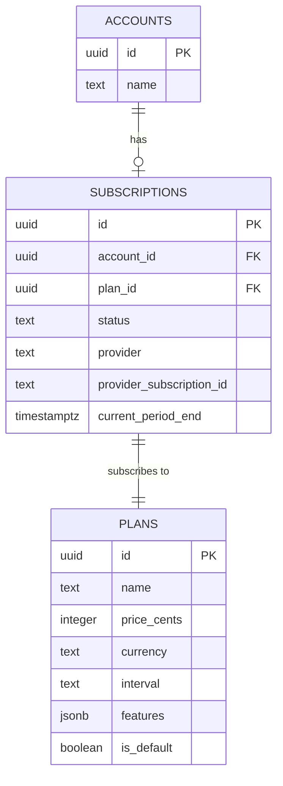

# Billing & Subscriptions

> Status: Production-ready (Integration layer - Payment provider not included)  
> Stack: PostgreSQL, NestJS, Next.js, Provider-agnostic (Stripe-ready)  
> Related Docs: [Multi-Tenancy](./multi-tenancy.md), [Super Admin Panel](./super-admin-panel.md)

## Overview & Key Concepts

The scaffold implements a **provider-agnostic billing system** with plans, subscriptions, and feature gating. While designed for Stripe integration, the architecture supports any payment provider through a consistent interface.

### Key Concepts

- **Plans**: Pricing tiers with features (Free, Pro, Enterprise)
- **Subscriptions**: Account-level billing relationships
- **Provider-Agnostic**: Abstraction layer for multiple payment processors
- **Feature Gating**: Limit features based on plan capabilities
- **Account-Level Billing**: One subscription per account (team)

### Architecture



## Implementation Details

### Key Files

**Backend:**
- `backend/src/plans/plans.service.ts` - Plan CRUD
- `backend/src/subscriptions/subscriptions.service.ts` - Subscription management
- `backend/src/plans/plans.controller.ts` - Plan endpoints
- `backend/src/subscriptions/subscriptions.controller.ts` - Subscription endpoints

**Frontend:**
- `frontend/src/app/dashboard/settings/billing/` - Billing settings UI
- `frontend/src/app/admin/plans/` - Plan management UI

### Database Schema

```sql
CREATE TABLE plans (
  id uuid PRIMARY KEY DEFAULT uuid_generate_v4(),
  name text NOT NULL,
  price_cents integer NOT NULL,
  currency text DEFAULT 'usd',
  interval text CHECK (interval IN ('month', 'year')) NOT NULL,
  features jsonb,
  is_default boolean DEFAULT false,
  is_hidden boolean DEFAULT false,
  created_at timestamptz DEFAULT now()
);

CREATE TABLE subscriptions (
  id uuid PRIMARY KEY DEFAULT uuid_generate_v4(),
  account_id uuid REFERENCES accounts(id) ON DELETE CASCADE,
  plan_id uuid REFERENCES plans(id),
  status text CHECK (status IN ('trialing','active','past_due','canceled')),
  provider text DEFAULT 'stripe',
  provider_subscription_id text,
  current_period_end timestamptz,
  created_at timestamptz DEFAULT now()
);
```

### Plans Service Implementation

```typescript
@Injectable()
export class PlansService {
  async getPlans(accessToken?: string) {
    const supabase = this.supabaseService.getClient(accessToken);
    
    const { data } = await supabase
      .from('plans')
      .select('*')
      .eq('is_hidden', false)
      .order('price_cents', { ascending: true });

    return data;
  }

  async createPlan(planData: CreatePlanDto) {
    const supabase = this.supabaseService.getAdminClient();
    
    const { data } = await supabase
      .from('plans')
      .insert({
        name: planData.name,
        price_cents: planData.price_cents,
        currency: planData.currency || 'usd',
        interval: planData.interval,
        features: planData.features,
        is_default: planData.is_default || false,
      })
      .select()
      .single();

    return data;
  }
}
```

### Feature Structure

```json
{
  "features": {
    "max_projects": 10,
    "max_members": 5,
    "ai_assistant": true,
    "vector_search": true,
    "custom_domain": false,
    "priority_support": false
  }
}
```

## API Reference

### GET `/plans`
Get all public plans.

**Response:**
```json
[
  {
    "id": "uuid",
    "name": "Pro",
    "price_cents": 2900,
    "currency": "usd",
    "interval": "month",
    "features": { "max_projects": 10 }
  }
]
```

### POST `/admin/plans` (Admin Only)
Create new plan.

**Request:**
```json
{
  "name": "Enterprise",
  "price_cents": 9900,
  "interval": "month",
  "features": { "max_projects": -1 }
}
```

### GET `/subscriptions/:accountId`
Get account subscription.

**Response:**
```json
{
  "id": "uuid",
  "account_id": "uuid",
  "plan": {
    "name": "Pro",
    "price_cents": 2900
  },
  "status": "active",
  "current_period_end": "2024-02-01T00:00:00Z"
}
```

## Best Practices

### 1. Feature Gating

✅ **Good**: Check plan features
```typescript
async createProject(accountId: string) {
  const subscription = await this.getSubscription(accountId);
  const plan = subscription.plan;
  
  if (plan.features.max_projects !== -1) {
    const count = await this.countProjects(accountId);
    if (count >= plan.features.max_projects) {
      throw new BadRequestException('Plan limit reached');
    }
  }
  
  return this.projectsService.create(accountId);
}
```

### 2. Provider Abstraction

```typescript
interface PaymentProvider {
  createSubscription(accountId: string, planId: string): Promise<Subscription>;
  cancelSubscription(subscriptionId: string): Promise<void>;
  updateSubscription(subscriptionId: string, planId: string): Promise<Subscription>;
}

class StripeProvider implements PaymentProvider {
  async createSubscription(accountId, planId) {
    // Stripe-specific implementation
  }
}
```

## Extension Guide

### Integrating Stripe

1. **Install Stripe SDK:**
```bash
npm install stripe
```

2. **Create Stripe Service:**
```typescript
@Injectable()
export class StripeService {
  private stripe: Stripe;

  constructor() {
    this.stripe = new Stripe(process.env.STRIPE_SECRET_KEY);
  }

  async createSubscription(accountId: string, planId: string) {
    const plan = await this.plansService.getPlan(planId);
    
    // Create Stripe customer
    const customer = await this.stripe.customers.create({
      metadata: { account_id: accountId },
    });

    // Create subscription
    const subscription = await this.stripe.subscriptions.create({
      customer: customer.id,
      items: [{ price: plan.stripe_price_id }],
    });

    // Save to database
    await this.subscriptionsService.create({
      account_id: accountId,
      plan_id: planId,
      provider: 'stripe',
      provider_subscription_id: subscription.id,
      status: subscription.status,
      current_period_end: new Date(subscription.current_period_end * 1000),
    });

    return subscription;
  }
}
```

3. **Handle Webhooks:**
```typescript
@Post('webhooks/stripe')
async handleStripeWebhook(@Req() req: any) {
  const sig = req.headers['stripe-signature'];
  const event = this.stripe.webhooks.constructEvent(
    req.body,
    sig,
    process.env.STRIPE_WEBHOOK_SECRET
  );

  switch (event.type) {
    case 'customer.subscription.updated':
      await this.updateSubscription(event.data.object);
      break;
    case 'customer.subscription.deleted':
      await this.cancelSubscription(event.data.object);
      break;
  }

  return { received: true };
}
```

### Adding Usage-Based Billing

```sql
CREATE TABLE usage_metrics (
  id uuid PRIMARY KEY,
  account_id uuid REFERENCES accounts(id),
  metric_name text NOT NULL,
  value integer NOT NULL,
  period_start timestamptz NOT NULL,
  period_end timestamptz NOT NULL
);

CREATE INDEX idx_usage_account_period 
  ON usage_metrics(account_id, period_start);
```

## Troubleshooting

**Q: How to handle trial periods?**

A: Use subscription status and trial_end date:
```typescript
const subscription = await this.getSubscription(accountId);
if (subscription.status === 'trialing') {
  const daysLeft = dayjs(subscription.trial_end).diff(dayjs(), 'day');
  return { inTrial: true, daysLeft };
}
```

**Q: How to prevent access after cancellation?**

A: Check subscription status in guards:
```typescript
const subscription = await this.getSubscription(accountId);
if (!subscription || ['canceled', 'past_due'].includes(subscription.status)) {
  throw new ForbiddenException('Active subscription required');
}
```

## Related Documentation

- [Multi-Tenancy](./multi-tenancy.md)
- [Super Admin Panel](./super-admin-panel.md)
- [Backend Architecture](./backend-architecture.md)
