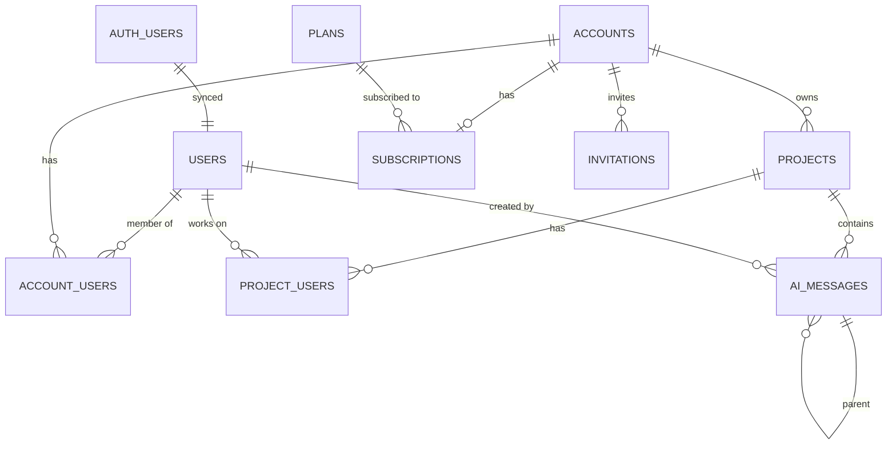

# Database Architecture

> Status: Production-ready  
> Stack: PostgreSQL 15+, Supabase, pgvector, Row-Level Security  
> Related Docs: [Backend Architecture](./backend-architecture.md), [Multi-Tenancy](./multi-tenancy.md), [Authentication](./authentication-authorization.md)

## Overview & Key Concepts

The database architecture is built on **PostgreSQL** with **Row-Level Security (RLS)** for multi-tenant data isolation, **pgvector** for semantic search, and **database functions** for complex operations.

### Key Features

- **Row-Level Security**: Automatic multi-tenant data isolation
- **Database Functions**: Reusable logic in PostgreSQL
- **Triggers**: Automatic profile creation and data sync
- **Vector Search**: pgvector extension for semantic similarity
- **Migration System**: Version-controlled schema changes
- **Foreign Key Cascades**: Automatic cleanup on deletion

### Core Tables



## Implementation Details

### Core Schema

#### 1. Users Table

**Purpose**: User profiles synced with auth.users

```sql
CREATE TABLE users (
  id uuid PRIMARY KEY REFERENCES auth.users(id) ON DELETE CASCADE,
  email text NOT NULL UNIQUE,
  name text,
  status text CHECK (status IN ('active', 'pending', 'suspended')) DEFAULT 'pending',
  name_embedding vector(1536),  -- For semantic search
  created_at timestamptz DEFAULT now()
);

-- Indexes
CREATE INDEX idx_users_email ON users(email);
CREATE INDEX idx_users_status ON users(status);
CREATE INDEX idx_users_name_embedding ON users USING hnsw (name_embedding vector_cosine_ops);
```

**RLS Policies:**
```sql
-- Users can view their own profile
CREATE POLICY "Users can view own profile" ON users
  FOR SELECT USING (auth.uid() = id);

-- Users can update their own profile
CREATE POLICY "Users can update own profile" ON users
  FOR UPDATE USING (auth.uid() = id);
```

#### 2. Accounts Table

**Purpose**: Team/organization entities (primary tenant)

```sql
CREATE TABLE accounts (
  id uuid PRIMARY KEY DEFAULT uuid_generate_v4(),
  name text NOT NULL,
  owner_user_id uuid REFERENCES users(id),
  created_at timestamptz DEFAULT now()
);

-- Indexes
CREATE INDEX idx_accounts_owner ON accounts(owner_user_id);
```

**RLS Policies:**
```sql
-- Users see accounts they belong to
CREATE POLICY "Users can view accounts they belong to" ON accounts
  FOR SELECT USING (
    id IN (SELECT get_auth_user_account_ids())
  );

-- Users can create accounts
CREATE POLICY "Users can create accounts" ON accounts
  FOR INSERT WITH CHECK (auth.uid() = owner_user_id);

-- Owners/admins can update
CREATE POLICY "Account members can update account" ON accounts
  FOR UPDATE USING (
    EXISTS (
      SELECT 1 FROM account_users
      WHERE account_users.account_id = accounts.id
        AND account_users.user_id = auth.uid()
        AND account_users.role IN ('owner', 'admin')
    )
  );
```

#### 3. Account Users Table

**Purpose**: Account membership and roles

```sql
CREATE TABLE account_users (
  id uuid PRIMARY KEY DEFAULT uuid_generate_v4(),
  account_id uuid REFERENCES accounts(id) ON DELETE CASCADE,
  user_id uuid REFERENCES users(id) ON DELETE CASCADE,
  role text CHECK (role IN ('owner', 'admin', 'member')),
  created_at timestamptz DEFAULT now(),
  UNIQUE (account_id, user_id)
);

-- Indexes
CREATE INDEX idx_account_users_account ON account_users(account_id);
CREATE INDEX idx_account_users_user ON account_users(user_id);
CREATE INDEX idx_account_users_role ON account_users(account_id, role);
```

**RLS Policies:**
```sql
-- Users see members of their accounts
CREATE POLICY "Users can view members of their accounts" ON account_users
  FOR SELECT USING (
    account_id IN (SELECT get_auth_user_account_ids())
  );

-- Owners/admins can manage members
CREATE POLICY "Owners/admins can manage members" ON account_users
  FOR ALL USING (
    EXISTS (
      SELECT 1 FROM account_users au
      WHERE au.account_id = account_users.account_id
        AND au.user_id = auth.uid()
        AND au.role IN ('owner', 'admin')
    )
  );
```

#### 4. Projects Table

**Purpose**: Projects within accounts

```sql
CREATE TABLE projects (
  id uuid PRIMARY KEY DEFAULT uuid_generate_v4(),
  account_id uuid REFERENCES accounts(id) ON DELETE CASCADE,
  name text NOT NULL,
  description text,
  description_embedding vector(1536),  -- For semantic search
  created_at timestamptz DEFAULT now()
);

-- Indexes
CREATE INDEX idx_projects_account ON projects(account_id);
CREATE INDEX idx_projects_description_embedding ON projects 
  USING hnsw (description_embedding vector_cosine_ops);
```

**RLS Policies:**
```sql
-- Users see projects in their accounts
CREATE POLICY "Users see projects in their accounts" ON projects
  FOR SELECT USING (
    account_id IN (SELECT get_auth_user_account_ids())
  );

-- Account members can create projects
CREATE POLICY "Account members can create projects" ON projects
  FOR INSERT WITH CHECK (
    account_id IN (SELECT get_auth_user_account_ids())
  );

-- Account admins can update/delete projects
CREATE POLICY "Account admins can manage projects" ON projects
  FOR ALL USING (
    EXISTS (
      SELECT 1 FROM account_users
      WHERE account_users.account_id = projects.account_id
        AND account_users.user_id = auth.uid()
        AND account_users.role IN ('owner', 'admin')
    )
  );
```

#### 5. Plans & Subscriptions

```sql
CREATE TABLE plans (
  id uuid PRIMARY KEY DEFAULT uuid_generate_v4(),
  name text NOT NULL,
  price_cents integer NOT NULL,
  currency text DEFAULT 'usd',
  interval text CHECK (interval IN ('month', 'year')) NOT NULL,
  features jsonb,
  is_default boolean DEFAULT false,
  is_hidden boolean DEFAULT false,
  created_at timestamptz DEFAULT now()
);

CREATE TABLE subscriptions (
  id uuid PRIMARY KEY DEFAULT uuid_generate_v4(),
  account_id uuid REFERENCES accounts(id) ON DELETE CASCADE,
  plan_id uuid REFERENCES plans(id),
  status text CHECK (status IN ('trialing','active','past_due','canceled')),
  provider text DEFAULT 'stripe',
  provider_subscription_id text,
  current_period_end timestamptz,
  created_at timestamptz DEFAULT now()
);

-- RLS: Plans are public, subscriptions are account-scoped
ALTER TABLE plans ENABLE ROW LEVEL SECURITY;
CREATE POLICY "Plans are publicly readable" ON plans
  FOR SELECT USING (true);

ALTER TABLE subscriptions ENABLE ROW LEVEL SECURITY;
CREATE POLICY "Users see their account subscriptions" ON subscriptions
  FOR SELECT USING (
    account_id IN (SELECT get_auth_user_account_ids())
  );
```

#### 6. AI Messages Table

```sql
CREATE TABLE ai_messages (
  id uuid PRIMARY KEY DEFAULT uuid_generate_v4(),
  conversation_id uuid NOT NULL,
  project_id uuid REFERENCES projects(id) ON DELETE CASCADE,
  user_id uuid REFERENCES users(id) ON DELETE CASCADE,
  role text CHECK (role IN ('user', 'assistant')) NOT NULL,
  content text NOT NULL,
  content_embedding vector(1536),
  parent_message_id uuid REFERENCES ai_messages(id),
  created_at timestamptz DEFAULT now()
);

-- Indexes
CREATE INDEX idx_ai_messages_conversation ON ai_messages(conversation_id);
CREATE INDEX idx_ai_messages_project ON ai_messages(project_id);
CREATE INDEX idx_ai_messages_user ON ai_messages(user_id);
CREATE INDEX idx_ai_messages_content_embedding ON ai_messages 
  USING hnsw (content_embedding vector_cosine_ops);

-- RLS
CREATE POLICY "Users see messages in their projects" ON ai_messages
  FOR SELECT USING (
    project_id IN (
      SELECT p.id FROM projects p
      WHERE p.account_id IN (SELECT get_auth_user_account_ids())
    )
  );
```

### Database Functions

#### 1. get_auth_user_account_ids()

**Purpose**: Helper for RLS policies - returns user's account IDs

```sql
CREATE OR REPLACE FUNCTION get_auth_user_account_ids()
RETURNS setof uuid
LANGUAGE sql
SECURITY DEFINER
SET search_path = public
STABLE
AS $$
  SELECT account_id FROM account_users 
  WHERE user_id = auth.uid();
$$;
```

#### 2. search_projects_vector()

**Purpose**: Vector similarity search for projects

```sql
CREATE OR REPLACE FUNCTION search_projects_vector(
  query_embedding text,
  match_limit int DEFAULT 10,
  similarity_threshold float DEFAULT 0.5
)
RETURNS TABLE (
  id uuid,
  name text,
  description text,
  account_id uuid,
  similarity float
) AS $$
BEGIN
  RETURN QUERY
  SELECT 
    p.id,
    p.name,
    p.description,
    p.account_id,
    1 - (p.description_embedding <=> query_embedding::vector) as similarity
  FROM projects p
  WHERE p.description_embedding IS NOT NULL
    AND 1 - (p.description_embedding <=> query_embedding::vector) > similarity_threshold
  ORDER BY p.description_embedding <=> query_embedding::vector
  LIMIT match_limit;
END;
$$ LANGUAGE plpgsql;
```

#### 3. exec_sql()

**Purpose**: Execute dynamic SQL (for AI assistant)

```sql
CREATE OR REPLACE FUNCTION exec_sql(
  query_text text,
  requesting_user_id uuid
)
RETURNS json AS $$
DECLARE
  result json;
BEGIN
  -- Security: Only allow SELECT statements
  IF query_text !~* '^\\s*SELECT' THEN
    RAISE EXCEPTION 'Only SELECT queries are allowed';
  END IF;

  -- Execute query
  EXECUTE format('SELECT json_agg(row_to_json(t)) FROM (%s) t', query_text)
  INTO result;

  RETURN COALESCE(result, '[]'::json);
END;
$$ LANGUAGE plpgsql SECURITY DEFINER;
```

### Triggers

#### 1. Auto-Create User Profile

**Purpose**: Sync auth.users with public.users

```sql
CREATE OR REPLACE FUNCTION handle_new_user()
RETURNS trigger AS $$
DECLARE
  new_account_id uuid;
BEGIN
  -- 1. Create user profile
  INSERT INTO public.users (id, email, name, status)
  VALUES (
    NEW.id,
    NEW.email,
    NEW.raw_user_meta_data->>'full_name',
    'pending'
  );

  -- 2. Create default account
  INSERT INTO public.accounts (name, owner_user_id)
  VALUES (
    COALESCE(NEW.raw_user_meta_data->>'full_name', 'My Account') || '''s Team',
    NEW.id
  )
  RETURNING id INTO new_account_id;

  -- 3. Add user as owner
  INSERT INTO public.account_users (account_id, user_id, role)
  VALUES (new_account_id, NEW.id, 'owner');

  RETURN NEW;
END;
$$ LANGUAGE plpgsql SECURITY DEFINER;

CREATE TRIGGER on_auth_user_created
  AFTER INSERT ON auth.users
  FOR EACH ROW EXECUTE FUNCTION handle_new_user();
```

### Vector Search Setup

```sql
-- Enable pgvector extension
CREATE EXTENSION IF NOT EXISTS vector;

-- Add vector columns
ALTER TABLE projects ADD COLUMN description_embedding vector(1536);
ALTER TABLE users ADD COLUMN name_embedding vector(1536);
ALTER TABLE ai_messages ADD COLUMN content_embedding vector(1536);

-- Create HNSW indexes for fast similarity search
CREATE INDEX idx_projects_description_embedding ON projects 
  USING hnsw (description_embedding vector_cosine_ops);

CREATE INDEX idx_users_name_embedding ON users 
  USING hnsw (name_embedding vector_cosine_ops);

CREATE INDEX idx_ai_messages_content_embedding ON ai_messages 
  USING hnsw (content_embedding vector_cosine_ops);
```

## Migration System

### Creating Migrations

```bash
cd backend/supabase
npx supabase migration new add_custom_field
```

### Migration File Structure

```sql
-- Migration: 20240201000000_add_custom_field.sql

-- Up Migration
ALTER TABLE projects ADD COLUMN custom_field text;

-- Create index if needed
CREATE INDEX idx_projects_custom_field ON projects(custom_field);

-- Update RLS policies if needed
DROP POLICY IF EXISTS "existing_policy" ON projects;
CREATE POLICY "updated_policy" ON projects
  FOR SELECT USING (...);
```

### Applying Migrations

```bash
# Apply all pending migrations
npx supabase migration up

# Rollback last migration
npx supabase migration down
```

## Best Practices

### 1. Always Enable RLS

✅ **Good**: Enable RLS on all tables
```sql
ALTER TABLE my_table ENABLE ROW LEVEL SECURITY;

CREATE POLICY "policy_name" ON my_table
  FOR SELECT USING (...);
```

❌ **Bad**: Relying only on application logic
```sql
-- No RLS = direct database access bypasses security
```

### 2. Use Helper Functions in RLS

✅ **Good**: Reusable function
```sql
CREATE POLICY "Users see own data" ON my_table
  FOR SELECT USING (
    account_id IN (SELECT get_auth_user_account_ids())
  );
```

❌ **Bad**: Duplicate logic
```sql
CREATE POLICY "Users see own data" ON my_table
  FOR SELECT USING (
    account_id IN (
      SELECT account_id FROM account_users WHERE user_id = auth.uid()
    )
  );
```

### 3. Use Foreign Key Cascades

✅ **Good**: Automatic cleanup
```sql
CREATE TABLE projects (
  account_id uuid REFERENCES accounts(id) ON DELETE CASCADE
);
```

### 4. Index Foreign Keys

✅ **Good**: Index for joins and lookups
```sql
CREATE INDEX idx_projects_account ON projects(account_id);
```

### 5. Use JSONB for Flexible Data

```sql
CREATE TABLE plans (
  features jsonb DEFAULT '{}'::jsonb
);

-- Query JSONB
SELECT * FROM plans WHERE features->>'max_projects' = '10';
```

## Extension Guide

### Adding New Table

```sql
-- 1. Create table
CREATE TABLE my_table (
  id uuid PRIMARY KEY DEFAULT uuid_generate_v4(),
  account_id uuid REFERENCES accounts(id) ON DELETE CASCADE,
  name text NOT NULL,
  created_at timestamptz DEFAULT now()
);

-- 2. Add indexes
CREATE INDEX idx_my_table_account ON my_table(account_id);

-- 3. Enable RLS
ALTER TABLE my_table ENABLE ROW LEVEL SECURITY;

-- 4. Create policies
CREATE POLICY "Users see own data" ON my_table
  FOR SELECT USING (
    account_id IN (SELECT get_auth_user_account_ids())
  );

CREATE POLICY "Users can insert" ON my_table
  FOR INSERT WITH CHECK (
    account_id IN (SELECT get_auth_user_account_ids())
  );
```

### Adding Vector Search to Table

```sql
-- 1. Add vector column
ALTER TABLE my_table ADD COLUMN content_embedding vector(1536);

-- 2. Create HNSW index
CREATE INDEX idx_my_table_embedding ON my_table 
  USING hnsw (content_embedding vector_cosine_ops);

-- 3. Create search function
CREATE FUNCTION search_my_table_vector(
  query_embedding text,
  match_limit int DEFAULT 10
)
RETURNS TABLE (...) AS $$
  -- Similar to search_projects_vector
$$ LANGUAGE plpgsql;
```

## Troubleshooting

**Q: RLS blocking queries**

A: Check if user is authenticated:
```sql
SELECT auth.uid();  -- Should return user ID
```

Check policy:
```sql
SELECT * FROM pg_policies WHERE tablename = 'projects';
```

**Q: Slow queries**

A: Add indexes:
```sql
CREATE INDEX idx_table_column ON table(column);

-- Analyze query
EXPLAIN ANALYZE SELECT * FROM projects WHERE account_id = '...';
```

**Q: Migration failed**

A: Check error, fix, and retry:
```bash
npx supabase migration repair
npx supabase migration up
```

## Related Documentation

- [Backend Architecture](./backend-architecture.md)
- [Multi-Tenancy](./multi-tenancy.md)
- [Authentication & Authorization](./authentication-authorization.md)
- [Global Search](./global-search.md)

### External Resources

- [PostgreSQL Documentation](https://www.postgresql.org/docs/)
- [Supabase RLS Guide](https://supabase.com/docs/guides/auth/row-level-security)
- [pgvector Documentation](https://github.com/pgvector/pgvector)
