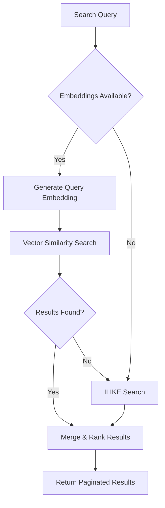

# Global Search System

> Status: Production-ready  
> Stack: PostgreSQL pgvector, OpenRouter Embeddings, NestJS, Next.js  
> Related Docs: [AI Assistant](./ai-assistant.md), [Database Architecture](./database-architecture.md)

## Overview & Key Concepts

The scaffold implements a **hybrid search system** combining semantic vector search (using pgvector) with traditional keyword search (ILIKE), providing both meaning-based and exact-match capabilities across users, accounts, and projects.

### Key Concepts

- **Vector Search**: Semantic similarity using AI embeddings (1536 dimensions)
- **Hybrid Search**: Combines vector + keyword search for best results
- **Fallback Strategy**: Uses ILIKE if embeddings unavailable
- **Non-Blocking Embeddings**: Search works even without embeddings
- **Cross-Entity Search**: Unified search across multiple data types

### Architecture



## Implementation Details

### Directory Structure

```
backend/src/
├── search/
│   ├── search.module.ts
│   ├── search.controller.ts
│   └── search.service.ts          # Hybrid search logic
├── ai-assistant/
│   └── services/
│       └── embedding.service.ts   # OpenRouter embeddings
└── supabase/
    └── migrations/
        └── 20260131000000_add_vector_search.sql
```

### Database Setup

```sql
-- Enable pgvector
CREATE EXTENSION IF NOT EXISTS vector;

-- Add vector columns
ALTER TABLE projects ADD COLUMN description_embedding vector(1536);
ALTER TABLE users ADD COLUMN name_embedding vector(1536);
ALTER TABLE ai_messages ADD COLUMN content_embedding vector(1536);

-- Create HNSW indexes for fast similarity search
CREATE INDEX ON projects USING hnsw (description_embedding vector_cosine_ops);
CREATE INDEX ON users USING hnsw (name_embedding vector_cosine_ops);
CREATE INDEX ON ai_messages USING hnsw (content_embedding vector_cosine_ops);
```

### Vector Search Functions

```sql
CREATE OR REPLACE FUNCTION search_projects_vector(
  query_embedding text,
  match_limit int DEFAULT 10,
  similarity_threshold float DEFAULT 0.5
)
RETURNS TABLE (
  id uuid,
  name text,
  description text,
  account_id uuid,
  similarity float
) AS $$
BEGIN
  RETURN QUERY
  SELECT 
    p.id,
    p.name,
    p.description,
    p.account_id,
    1 - (p.description_embedding <=> query_embedding::vector) as similarity
  FROM projects p
  WHERE p.description_embedding IS NOT NULL
    AND 1 - (p.description_embedding <=> query_embedding::vector) > similarity_threshold
  ORDER BY p.description_embedding <=> query_embedding::vector
  LIMIT match_limit;
END;
$$ LANGUAGE plpgsql;
```

### Search Service Implementation

```typescript
@Injectable()
export class SearchService {
  constructor(
    private readonly supabaseService: SupabaseService,
    private readonly embeddingService: EmbeddingService,
  ) {}

  async searchGlobal(query: string, userId: string) {
    const supabase = this.supabaseService.getClient();
    const results: SearchResults = {
      users: [],
      projects: [],
      accounts: [],
    };

    // Try vector search if embeddings available
    if (this.embeddingService.isConfigured()) {
      try {
        const queryEmbedding = await this.embeddingService.generateEmbedding(query);
        
        // Vector search projects
        const { data: vectorProjects } = await supabase.rpc('search_projects_vector', {
          query_embedding: JSON.stringify(queryEmbedding),
          match_limit: 20,
          similarity_threshold: 0.3,
        });

        if (vectorProjects?.length > 0) {
          results.projects = vectorProjects.map(p => ({
            ...p,
            searchMethod: 'vector',
          }));
        }

        // Vector search users
        const { data: vectorUsers } = await supabase.rpc('search_users_vector', {
          query_embedding: JSON.stringify(queryEmbedding),
          match_limit: 10,
        });

        if (vectorUsers?.length > 0) {
          results.users = vectorUsers;
        }
      } catch (error) {
        this.logger.warn(`Vector search failed: ${error.message}`);
        // Fall through to ILIKE search
      }
    }

    // Fallback ILIKE search for entries without embeddings
    if (results.projects.length === 0) {
      const { data: ilikeProjects } = await supabase
        .from('projects')
        .select('*')
        .or(`name.ilike.%${query}%,description.ilike.%${query}%`)
        .limit(20);

      results.projects = ilikeProjects?.map(p => ({
        ...p,
        searchMethod: 'ilike',
      })) || [];
    }

    if (results.users.length === 0) {
      const { data: ilikeUsers } = await supabase
        .from('users')
        .select('*')
        .or(`name.ilike.%${query}%,email.ilike.%${query}%`)
        .limit(10);

      results.users = ilikeUsers || [];
    }

    return results;
  }
}
```

### Embedding Service

```typescript
@Injectable()
export class EmbeddingService {
  private model: ChatOpenAI;
  private dimensions: number = 1536;

  constructor(private readonly configService: ConfigService) {
    const apiKey = this.configService.get<string>('OPENROUTER_API_KEY');
    const model = this.configService.get<string>('EMBEDDING_MODEL');

    if (apiKey && model) {
      this.model = new ChatOpenAI({
        openAIApiKey: apiKey,
        configuration: {
          baseURL: 'https://openrouter.ai/api/v1',
        },
        modelName: model,
      });
    }
  }

  isConfigured(): boolean {
    return !!this.model;
  }

  async generateEmbedding(text: string): Promise<number[]> {
    if (!this.isConfigured()) {
      throw new Error('Embedding service not configured');
    }

    const response = await fetch('https://openrouter.ai/api/v1/embeddings', {
      method: 'POST',
      headers: {
        'Authorization': `Bearer ${this.apiKey}`,
        'Content-Type': 'application/json',
      },
      body: JSON.stringify({
        model: 'openai/text-embedding-3-small',
        input: text,
      }),
    });

    const data = await response.json();
    return data.data[0].embedding;
  }
}
```

## API Reference

### GET `/search?q=query`
Global search across entities.

**Query Parameters:**
- `q` - Search query (required)

**Response:**
```json
{
  "users": [
    {
      "id": "uuid",
      "name": "John Doe",
      "email": "john@example.com",
      "similarity": 0.85
    }
  ],
  "projects": [
    {
      "id": "uuid",
      "name": "Website Redesign",
      "description": "Complete overhaul...",
      "similarity": 0.92,
      "searchMethod": "vector"
    }
  ],
  "accounts": []
}
```

## Configuration

### Environment Variables

```bash
# OpenRouter API (for embeddings)
OPENROUTER_API_KEY=sk-or-v1-...
EMBEDDING_MODEL=openai/text-embedding-3-small
VECTOR_DIMENSIONS=1536
```

### Generating Missing Embeddings

```typescript
// Admin endpoint to backfill embeddings
@Post('admin/generate-embeddings')
@UseGuards(AuthGuard, AdminGuard)
async generateEmbeddings(@Query('entity') entity: string) {
  if (entity === 'projects') {
    const { data: projects } = await this.supabase
      .from('projects')
      .select('*')
      .is('description_embedding', null);

    for (const project of projects) {
      if (project.description) {
        const embedding = await this.embeddingService.generateEmbedding(
          project.description
        );
        
        await this.supabase
          .from('projects')
          .update({ description_embedding: JSON.stringify(embedding) })
          .eq('id', project.id);
      }
    }
  }

  return { success: true };
}
```

### Checking Embedding Coverage

```sql
CREATE FUNCTION check_embeddings_status()
RETURNS TABLE (
  table_name text,
  total_rows bigint,
  with_embeddings bigint,
  coverage_percent numeric
) AS $$
BEGIN
  RETURN QUERY
  SELECT 
    'projects'::text,
    COUNT(*)::bigint,
    COUNT(description_embedding)::bigint,
    ROUND(COUNT(description_embedding)::numeric / NULLIF(COUNT(*), 0) * 100, 2)
  FROM projects
  UNION ALL
  SELECT 
    'users'::text,
    COUNT(*)::bigint,
    COUNT(name_embedding)::bigint,
    ROUND(COUNT(name_embedding)::numeric / NULLIF(COUNT(*), 0) * 100, 2)
  FROM users;
END;
$$ LANGUAGE plpgsql;
```

## Best Practices

### 1. Non-Blocking Embedding Generation

✅ **Good**: Don't fail operations if embedding fails
```typescript
async createProject(data: CreateProjectDto) {
  let embedding = null;
  
  try {
    embedding = await this.embeddingService.generateEmbedding(data.description);
  } catch (error) {
    this.logger.warn('Embedding generation failed, continuing...');
    // Continue without embedding
  }

  return this.supabase.from('projects').insert({
    ...data,
    description_embedding: embedding ? JSON.stringify(embedding) : null,
  });
}
```

### 2. Adjust Similarity Thresholds

```typescript
// Lower threshold for broader results
similarity_threshold: 0.3  // More results, less precise

// Higher threshold for precise results
similarity_threshold: 0.7  // Fewer results, more precise
```

### 3. Combine Search Methods

```typescript
// Use vector for semantic, ILIKE for exact matches
const vectorResults = await this.vectorSearch(query);
const keywordResults = await this.keywordSearch(query);

// Merge and deduplicate
const merged = this.mergeResults(vectorResults, keywordResults);
```

## Extension Guide

### Adding More Searchable Entities

1. **Add vector column:**
```sql
ALTER TABLE accounts ADD COLUMN name_embedding vector(1536);
CREATE INDEX ON accounts USING hnsw (name_embedding vector_cosine_ops);
```

2. **Create RPC function:**
```sql
CREATE FUNCTION search_accounts_vector(...)
RETURNS TABLE (...) AS $$
  -- Similar to search_projects_vector
$$ LANGUAGE plpgsql;
```

3. **Update search service:**
```typescript
const { data: accounts } = await supabase.rpc('search_accounts_vector', {
  query_embedding: JSON.stringify(queryEmbedding),
});
```

### Switching Embedding Models

```bash
# Change to different model
EMBEDDING_MODEL=openai/text-embedding-3-large
VECTOR_DIMENSIONS=3072
```

**Note**: Requires re-generating all embeddings and updating vector column dimensions.

## Troubleshooting

**Q: Vector search returns no results**

A: Check embedding coverage:
```sql
SELECT check_embeddings_status();
```

Generate missing embeddings via admin endpoint.

**Q: Search is slow**

A: Ensure HNSW indexes exist:
```sql
SELECT indexname, tablename 
FROM pg_indexes 
WHERE indexdef LIKE '%hnsw%';
```

**Q: Embeddings are expensive**

A: Cache embeddings and only regenerate on updates:
```typescript
// Only generate if description changed
if (oldDescription !== newDescription) {
  embedding = await this.embeddingService.generateEmbedding(newDescription);
}
```

## Related Documentation

- [AI Assistant](./ai-assistant.md) - Uses same embedding service
- [Database Architecture](./database-architecture.md) - Vector columns and indexes
- [Backend Architecture](./backend-architecture.md) - Service patterns
