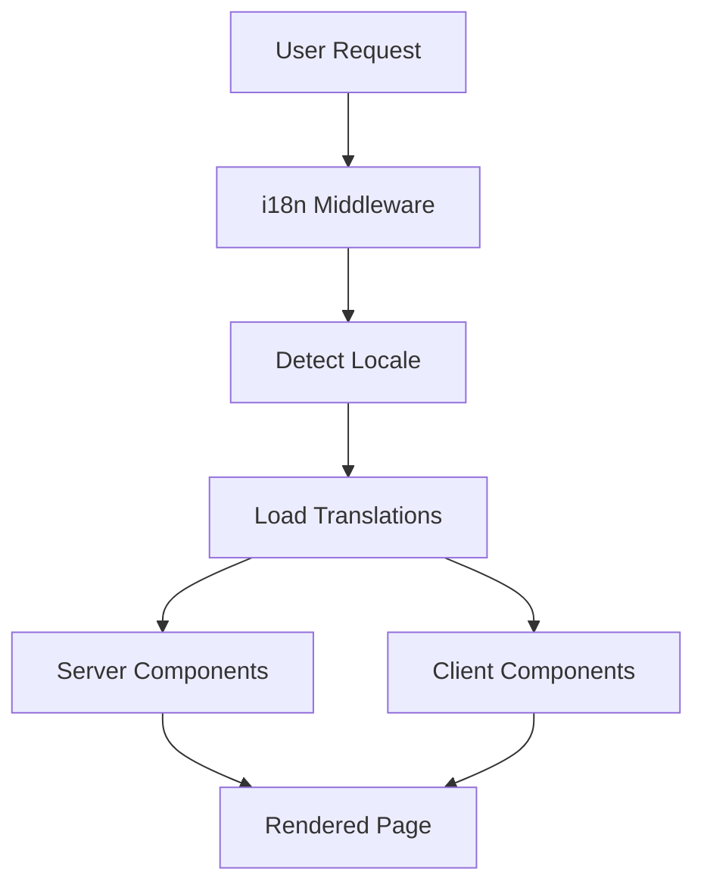

# Internationalization (i18n)

> Status: Production-ready  
> Stack: next-intl, 7 languages, JSON translation files  
> Related Docs: [UI Components](./ui-components.md), [Backend Architecture](./backend-architecture.md)

## Overview & Key Concepts

The scaffold implements **full internationalization support** using next-intl with 7 pre-configured languages and namespaced translations for better organization and performance.

### Supported Languages

- 🇬🇧 English (en) - Default
- 🇪🇸 Spanish (es)
- 🇫🇷 French (fr)
- 🇩🇪 German (de)
- 🇮🇹 Italian (it)
- 🇯🇵 Japanese (ja)
- 🇨🇳 Chinese (zh)

### Key Concepts

- **Namespaces**: Translations organized by feature (auth, account, billing, etc.)
- **SSR-Compatible**: Works with Next.js server components
- **Type-Safe**: TypeScript support for translation keys
- **Lazy Loading**: Only load needed translations

### Architecture



## Implementation Details

### Directory Structure

```
frontend/
├── public/
│   └── locales/
│       ├── en/
│       │   ├── auth.json
│       │   ├── account.json
│       │   ├── billing.json
│       │   ├── teams.json
│       │   ├── projects.json
│       │   ├── admin.json
│       │   ├── common.json
│       │   └── errors.json
│       ├── es/
│       │   └── ... (same structure)
│       ├── fr/
│       ├── de/
│       ├── it/
│       ├── ja/
│       └── zh/
└── src/
    ├── lib/
    │   └── i18n/
    │       ├── config.ts
    │       ├── request.ts
    │       └── navigation.ts
    ├── middleware.ts
    └── components/
        └── language-switcher.tsx
```

### Translation File Structure

```json
// public/locales/en/auth.json
{
  "login": {
    "title": "Welcome Back",
    "email": "Email",
    "password": "Password",
    "submit": "Sign In",
    "forgotPassword": "Forgot password?",
    "noAccount": "Don't have an account?",
    "signUp": "Sign up"
  },
  "signup": {
    "title": "Create Account",
    "name": "Full Name",
    "email": "Email",
    "password": "Password",
    "submit": "Create Account",
    "hasAccount": "Already have an account?",
    "signIn": "Sign in"
  },
  "errors": {
    "invalidCredentials": "Invalid email or password",
    "emailTaken": "Email already in use",
    "weakPassword": "Password must be at least 8 characters"
  }
}
```

### i18n Configuration

```typescript
// src/lib/i18n/config.ts
export const locales = ['en', 'es', 'fr', 'de', 'it', 'ja', 'zh'] as const;
export type Locale = (typeof locales)[number];

export const defaultLocale: Locale = 'en';

export const localeNames: Record<Locale, string> = {
  en: 'English',
  es: 'Español',
  fr: 'Français',
  de: 'Deutsch',
  it: 'Italiano',
  ja: '日本語',
  zh: '中文',
};

export const namespaces = [
  'auth',
  'account',
  'billing',
  'teams',
  'projects',
  'admin',
  'common',
  'errors',
] as const;
```

### Middleware Setup

```typescript
// src/middleware.ts
import createMiddleware from 'next-intl/middleware';
import { locales, defaultLocale } from './lib/i18n/config';

export default createMiddleware({
  locales,
  defaultLocale,
  localePrefix: 'as-needed', // Only add prefix for non-default locales
});

export const config = {
  matcher: ['/((?!api|_next|_vercel|.*\\..*).*)'],
};
```

### Server Component Usage

```typescript
// app/[locale]/auth/login/page.tsx
import { useTranslations } from 'next-intl';

export default function LoginPage() {
  const t = useTranslations('auth.login');

  return (
    <div>
      <h1>{t('title')}</h1>
      <form>
        <label>{t('email')}</label>
        <input type="email" />
        
        <label>{t('password')}</label>
        <input type="password" />
        
        <button>{t('submit')}</button>
      </form>
      <a href="/forgot-password">{t('forgotPassword')}</a>
    </div>
  );
}
```

### Client Component Usage

```typescript
'use client';

import { useTranslations } from 'next-intl';

export function LoginForm() {
  const t = useTranslations('auth.login');
  const tErrors = useTranslations('auth.errors');

  async function handleSubmit(data: FormData) {
    try {
      await login(data);
    } catch (error) {
      toast.error(tErrors('invalidCredentials'));
    }
  }

  return (
    <form action={handleSubmit}>
      <Input placeholder={t('email')} />
      <Button>{t('submit')}</Button>
    </form>
  );
}
```

### Language Switcher Component

```typescript
'use client';

import { useLocale } from 'next-intl';
import { useRouter, usePathname } from 'next/navigation';
import { locales, localeNames } from '@/lib/i18n/config';

export function LanguageSwitcher() {
  const locale = useLocale();
  const router = useRouter();
  const pathname = usePathname();

  function handleChange(newLocale: string) {
    // Remove current locale from pathname
    const pathWithoutLocale = pathname.replace(`/${locale}`, '');
    
    // Add new locale
    const newPath = newLocale === 'en' 
      ? pathWithoutLocale 
      : `/${newLocale}${pathWithoutLocale}`;
    
    router.push(newPath);
  }

  return (
    <Select value={locale} onValueChange={handleChange}>
      {locales.map((loc) => (
        <SelectItem key={loc} value={loc}>
          {localeNames[loc]}
        </SelectItem>
      ))}
    </Select>
  );
}
```

## Configuration

### Adding New Namespace

1. **Create translation files:**
```bash
mkdir -p public/locales/{en,es,fr,de,it,ja,zh}/settings
```

2. **Add translations:**
```json
// public/locales/en/settings.json
{
  "profile": {
    "title": "Profile Settings",
    "name": "Name",
    "email": "Email",
    "save": "Save Changes"
  }
}
```

3. **Register namespace:**
```typescript
// src/lib/i18n/config.ts
export const namespaces = [
  // ... existing
  'settings',
] as const;
```

4. **Use in components:**
```typescript
const t = useTranslations('settings.profile');
```

### Adding New Language

1. **Add locale to config:**
```typescript
export const locales = ['en', 'es', 'fr', 'de', 'it', 'ja', 'zh', 'pt'] as const;

export const localeNames: Record<Locale, string> = {
  // ... existing
  pt: 'Português',
};
```

2. **Create translation directory:**
```bash
mkdir -p public/locales/pt
cp -r public/locales/en/* public/locales/pt/
```

3. **Translate files** in `public/locales/pt/`

## Best Practices

### 1. Use Namespaces for Organization

✅ **Good**: Organized by feature
```typescript
const tAuth = useTranslations('auth.login');
const tCommon = useTranslations('common');
const tErrors = useTranslations('errors');
```

❌ **Bad**: Single large file
```typescript
const t = useTranslations(); // Loads everything
```

### 2. Provide Context in Keys

✅ **Good**: Clear context
```json
{
  "button": {
    "save": "Save",
    "cancel": "Cancel",
    "delete": "Delete"
  },
  "message": {
    "saveSuccess": "Changes saved successfully",
    "deleteConfirm": "Are you sure you want to delete?"
  }
}
```

❌ **Bad**: Ambiguous keys
```json
{
  "save": "Save",
  "success": "Success",
  "confirm": "Confirm"
}
```

### 3. Handle Pluralization

```json
{
  "items": {
    "zero": "No items",
    "one": "1 item",
    "other": "{count} items"
  }
}
```

```typescript
const t = useTranslations('common');
t('items', { count: 0 }); // "No items"
t('items', { count: 1 }); // "1 item"
t('items', { count: 5 }); // "5 items"
```

### 4. Use Rich Text for Formatting

```json
{
  "welcome": "Welcome back, <strong>{name}</strong>!"
}
```

```typescript
t.rich('welcome', {
  name: user.name,
  strong: (chunks) => <strong>{chunks}</strong>,
});
```

## Extension Guide

### Adding Date/Time Formatting

```typescript
import { useFormatter } from 'next-intl';

export function DateDisplay({ date }: Props) {
  const format = useFormatter();

  return (
    <div>
      {format.dateTime(date, {
        year: 'numeric',
        month: 'long',
        day: 'numeric',
      })}
    </div>
  );
}
```

### Adding Number Formatting

```typescript
const format = useFormatter();

// Currency
format.number(1234.56, {
  style: 'currency',
  currency: 'USD',
}); // "$1,234.56"

// Percentage
format.number(0.85, {
  style: 'percent',
}); // "85%"
```

### Dynamic Translation Loading

```typescript
// Only load needed translations
import { getTranslations } from 'next-intl/server';

export async function generateMetadata({ params }: Props) {
  const t = await getTranslations({ locale: params.locale, namespace: 'meta' });

  return {
    title: t('title'),
    description: t('description'),
  };
}
```

## Troubleshooting

**Q: Translations not updating**

A: Clear Next.js cache:
```bash
rm -rf .next
npm run dev
```

**Q: Missing translation warning**

A: Check file exists and key is correct:
```bash
cat public/locales/en/auth.json | jq '.login.title'
```

**Q: Locale not detected**

A: Check middleware matcher:
```typescript
export const config = {
  matcher: ['/((?!api|_next|.*\\..*).*)'],
};
```

**Q: How to translate dynamic content from database?**

A: Store translations in database:
```sql
CREATE TABLE project_translations (
  project_id uuid,
  locale text,
  name text,
  description text,
  PRIMARY KEY (project_id, locale)
);
```

## Related Documentation

- [UI Components](./ui-components.md)
- [Backend Architecture](./backend-architecture.md)
- [Super Admin Panel](./super-admin-panel.md)

### External Resources

- [next-intl Documentation](https://next-intl-docs.vercel.app/)
- [ICU Message Format](https://unicode-org.github.io/icu/userguide/format_parse/messages/)
