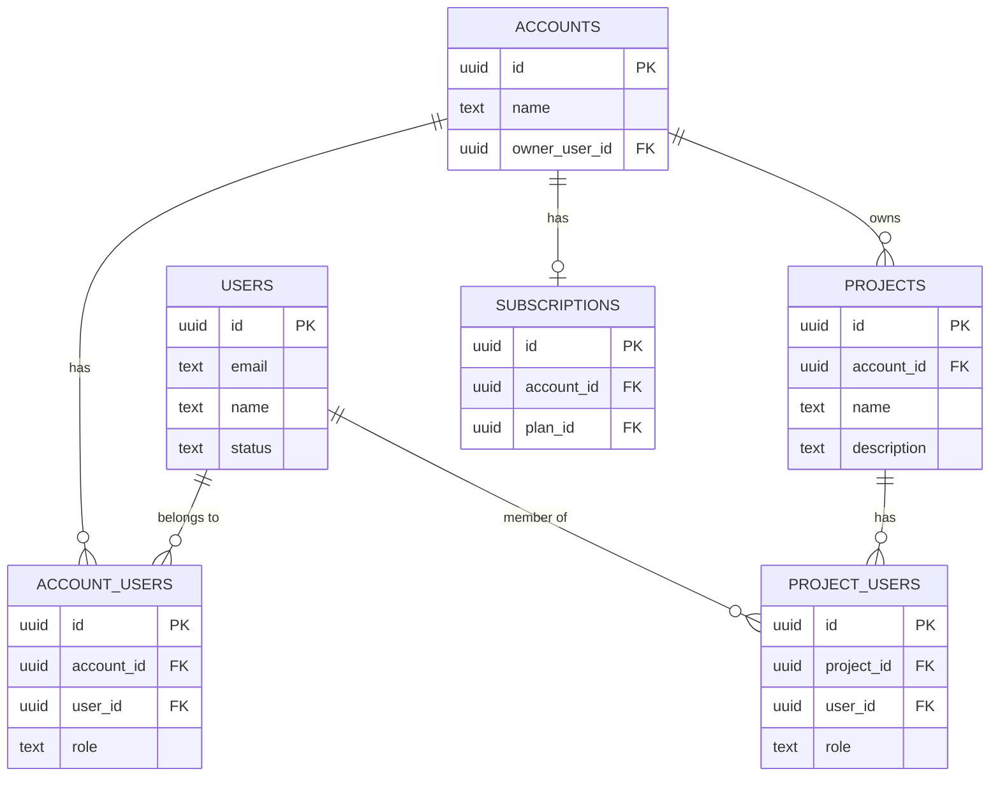
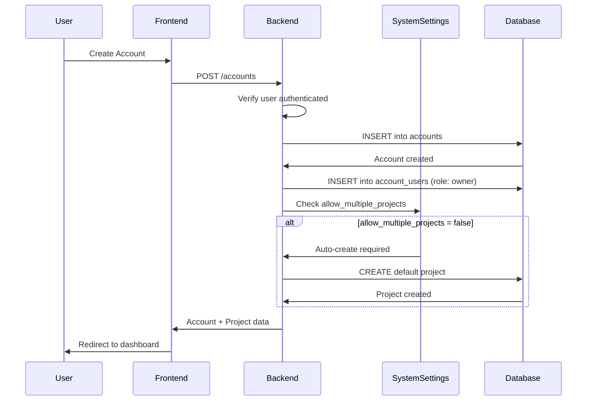
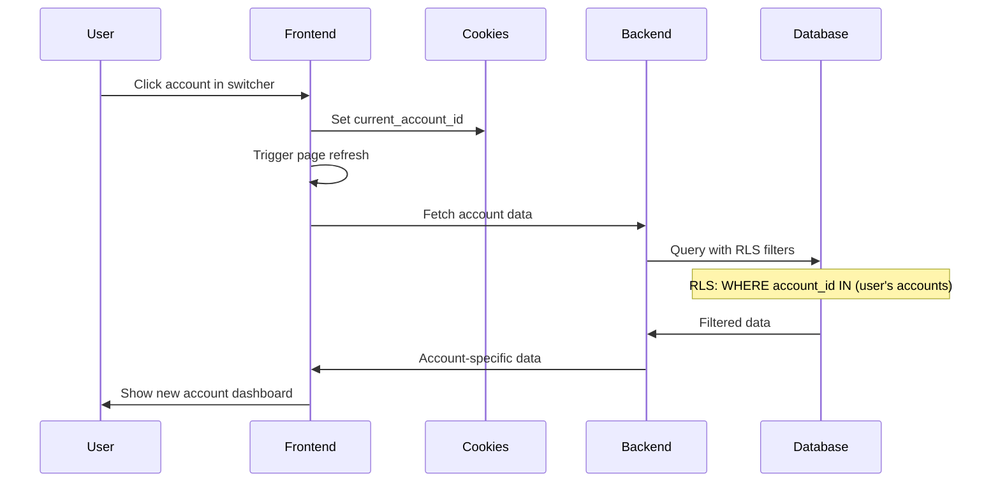
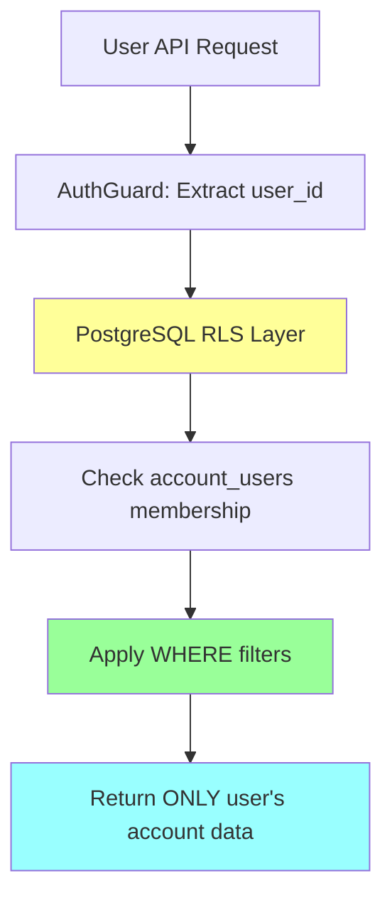

# Multi-Tenancy System

> Status: Production-ready  
> Stack: PostgreSQL, Supabase RLS, NestJS, Next.js  
> Related Docs: [Authentication](./authentication-authorization.md), [User Management](./user-management.md), [Database Architecture](./database-architecture.md)

## Overview & Key Concepts

The scaffold implements a **flexible multi-tenant architecture** that supports both B2B SaaS (multiple teams) and B2C SaaS (single user accounts) through runtime configuration. Each tenant (account) is isolated at the database level using Row-Level Security (RLS) policies, ensuring complete data separation.

### Key Concepts

- **Account (Team)**: The primary tenant entity. Users belong to one or more accounts.
- **Multi-Tenancy**: Multiple independent tenants (accounts) sharing the same application instance.
- **Data Isolation**: RLS policies ensure accounts can only access their own data.
- **Hierarchical Permissions**: Roles cascade from account-level to project-level.
- **Dynamic UI Adaptation**: UI elements show/hide based on system settings.

### Tenant Hierarchy

```
Account (Team)
├── Account Members (owner, admin, member)
├── Projects
│   ├── Project Members (admin, editor, viewer)
│   └── Project Data
└── Subscriptions
```

### Supported Configurations

| Mode | `allow_multiple_teams` | `allow_multiple_projects` | Use Case |
|------|------------------------|---------------------------|----------|
| **B2B SaaS** | `true` | `true` | Multiple companies, each with multiple projects |
| **B2C SaaS** | `false` | `false` | Individual users, single default project |
| **Agency** | `false` | `true` | Single agency account, multiple client projects |
| **Platform** | `true` | `false` | Multiple teams, single project per team |

---

## Architecture & How It Works

### Multi-Tenant Data Model



### Account Creation Flow



### Account Switching Flow



### RLS Data Isolation



---

## Implementation Details

### Directory Structure

```
backend/src/
├── accounts/
│   ├── accounts.module.ts
│   ├── accounts.controller.ts
│   ├── accounts.service.ts          # Account CRUD
│   └── admin-accounts.controller.ts
├── projects/
│   ├── projects.module.ts
│   ├── projects.controller.ts
│   ├── projects.service.ts          # Project CRUD
│   └── admin-projects.controller.ts
├── teams/
│   ├── teams.module.ts
│   ├── teams.controller.ts
│   └── teams.service.ts             # Team member management
└── system-settings/
    ├── system-settings.service.ts   # Multi-tenancy config

frontend/src/
├── components/
│   ├── team-switcher.tsx            # Account navigation
│   ├── nav-projects.tsx             # Project navigation
│   └── create-team-dialog.tsx
└── app/
    └── dashboard/
        ├── switch-action.ts         # Account switching logic
        └── settings/
            └── team/                # Team management UI
```

### Key Files Walkthrough

#### 1. AccountsService (`backend/src/accounts/accounts.service.ts`)

Manages account creation, updates, and member retrieval.

```typescript
@Injectable()
export class AccountsService {
  constructor(
    private readonly supabaseService: SupabaseService,
    private readonly accessControlHelper: AccessControlHelper,
    private readonly systemSettingsService: SystemSettingsService,
    private readonly projectsService: ProjectsService,
  ) {}

  async createAccount(userId: string, name: string, accessToken?: string) {
    const supabase = this.supabaseService.getClient(accessToken);

    // 1. Create account
    const { data: account } = await supabase
      .from('accounts')
      .insert({ name, owner_user_id: userId })
      .select()
      .single();

    // 2. Add creator as owner
    await supabase.from('account_users').insert({
      account_id: account.id,
      user_id: userId,
      role: 'owner',
    });

    // 3. Auto-create project if multi-project disabled
    const settings = await this.systemSettingsService.getSettings();
    if (!settings.allow_multiple_projects) {
      await this.projectsService.createProject(
        account.id,
        'Default Project',
        userId,
        accessToken
      );
    }

    return account;
  }

  async getUserAccounts(userId: string, accessToken?: string) {
    const supabase = this.supabaseService.getClient(accessToken);

    // RLS automatically filters to user's accounts
    const { data } = await supabase
      .from('account_users')
      .select(`
        role,
        account:accounts (id, name)
      `)
      .eq('user_id', userId);

    return data.map(item => ({
      id: item.account.id,
      name: item.account.name,
      role: item.role,
    }));
  }
}
```

**Key Features:**
- Automatic owner role assignment
- Integration with system settings for default project creation
- Uses RLS for automatic data filtering

#### 2. ProjectsService (`backend/src/projects/projects.service.ts`)

Manages projects within accounts.

```typescript
@Injectable()
export class ProjectsService {
  async createProject(
    accountId: string,
    name: string,
    userId: string,
    accessToken?: string
  ) {
    const supabase = this.supabaseService.getClient(accessToken);

    // Verify user belongs to account
    await this.accessControlHelper.verifyAccountAccess(
      supabase,
      accountId,
      userId
    );

    // Create project
    const { data } = await supabase
      .from('projects')
      .insert({ account_id: accountId, name })
      .select()
      .single();

    // Add creator as project admin
    await supabase.from('project_users').insert({
      project_id: data.id,
      user_id: userId,
      role: 'admin',
    });

    return data;
  }

  async getAccountProjects(accountId: string, userId: string) {
    const supabase = this.supabaseService.getClient();

    // Verify access
    await this.accessControlHelper.verifyAccountAccess(
      supabase,
      accountId,
      userId
    );

    // RLS filters to account's projects
    const { data } = await supabase
      .from('projects')
      .select('*')
      .eq('account_id', accountId);

    return data;
  }
}
```

#### 3. AccessControlHelper (`backend/src/common/helpers/access-control.helper.ts`)

Centralized permission verification.

```typescript
@Injectable()
export class AccessControlHelper {
  async verifyAccountAccess(
    supabase: SupabaseClient,
    accountId: string,
    userId: string,
    requiredRoles: string[] = []
  ) {
    const { data, error } = await supabase
      .from('account_users')
      .select('role')
      .eq('account_id', accountId)
      .eq('user_id', userId)
      .single();

    if (error || !data) {
      throw new ForbiddenException('Access denied to this account');
    }

    if (requiredRoles.length > 0 && !requiredRoles.includes(data.role)) {
      throw new ForbiddenException(`Requires one of: ${requiredRoles.join(', ')}`);
    }

    return data;
  }

  async verifyProjectAccess(
    supabase: SupabaseClient,
    projectId: string,
    userId: string
  ) {
    // Check if user has project access OR account admin/owner
    const { data: project } = await supabase
      .from('projects')
      .select('account_id')
      .eq('id', projectId)
      .single();

    if (!project) {
      throw new NotFoundException('Project not found');
    }

    // Check account membership
    await this.verifyAccountAccess(supabase, project.account_id, userId);

    return { accountId: project.account_id };
  }
}
```

#### 4. Team Switcher Component (`frontend/src/components/team-switcher.tsx`)

Frontend component for account navigation.

```typescript
export function TeamSwitcher({ teams, activeTeam, readOnly }: Props) {
  const [activeTeam, setActiveTeam] = useState(initialActiveTeam || teams[0]);

  // Hide if only one team and system disallows multiple
  if (readOnly || teams.length === 1) {
    return null;
  }

  return (
    <DropdownMenu>
      <DropdownMenuTrigger>
        <div>
          <span>{activeTeam.name}</span>
          <span>{activeTeam.plan}</span>
        </div>
      </DropdownMenuTrigger>
      <DropdownMenuContent>
        {teams.map((team) => (
          <DropdownMenuItem
            key={team.id}
            onClick={() => {
              setActiveTeam(team);
              switchAccount(team.id);
            }}
          >
            {team.name}
          </DropdownMenuItem>
        ))}
        <CreateTeamDialog>
          <DropdownMenuItem>Add team</DropdownMenuItem>
        </CreateTeamDialog>
      </DropdownMenuContent>
    </DropdownMenu>
  );
}
```

#### 5. System Settings Service

Controls multi-tenancy behavior.

```typescript
export interface SystemSettings {
  allow_multiple_projects: boolean;
  allow_multiple_teams: boolean;
  theme_set: string;
  extended_settings: Record<string, unknown>;
}

@Injectable()
export class SystemSettingsService {
  async getSettings(): Promise<SystemSettings> {
    const { data } = await this.supabase
      .from('system_settings')
      .select('*')
      .single();

    return data || {
      allow_multiple_projects: true,
      allow_multiple_teams: true,
      theme_set: 'corporate',
      extended_settings: {},
    };
  }
}
```

---

## API Reference

### Backend Endpoints

#### GET `/accounts`
Get all accounts for the authenticated user.

**Headers:**
```
Authorization: Bearer <access_token>
```

**Response (200):**
```json
[
  {
    "id": "uuid",
    "name": "Acme Corp",
    "role": "owner",
    "plan": "Pro"
  },
  {
    "id": "uuid",
    "name": "Side Project",
    "role": "member",
    "plan": "Free"
  }
]
```

#### POST `/accounts`
Create a new account.

**Headers:**
```
Authorization: Bearer <access_token>
```

**Request Body:**
```json
{
  "name": "New Company"
}
```

**Response (201):**
```json
{
  "id": "uuid",
  "name": "New Company",
  "owner_user_id": "uuid",
  "created_at": "2024-01-01T00:00:00Z"
}
```

**Side Effects:**
- Creates `account_users` entry with role `owner`
- If `allow_multiple_projects = false`, creates default project

#### PATCH `/accounts/:id`
Update account name (owner/admin only).

**Headers:**
```
Authorization: Bearer <access_token>
```

**Request Body:**
```json
{
  "name": "Updated Name"
}
```

**Response (200):**
```json
{
  "id": "uuid",
  "name": "Updated Name",
  "updated_at": "2024-01-01T00:00:00Z"
}
```

**Errors:**
- `403` - User is not owner/admin
- `404` - Account not found

#### GET `/accounts/:accountId/projects`
Get all projects in an account.

**Headers:**
```
Authorization: Bearer <access_token>
```

**Response (200):**
```json
[
  {
    "id": "uuid",
    "name": "Website Redesign",
    "description": "Company website overhaul",
    "created_at": "2024-01-01T00:00:00Z",
    "url": "/dashboard/projects/uuid"
  }
]
```

#### POST `/accounts/:accountId/projects`
Create a project in an account.

**Headers:**
```
Authorization: Bearer <access_token>
```

**Request Body:**
```json
{
  "name": "New Project",
  "description": "Optional description"
}
```

**Response (201):**
```json
{
  "id": "uuid",
  "account_id": "uuid",
  "name": "New Project",
  "description": "Optional description",
  "created_at": "2024-01-01T00:00:00Z"
}
```

**Side Effects:**
- Creates `project_users` entry with creator as `admin`
- Generates embedding for description (if configured)

### Database Tables

#### `accounts` Table

```sql
CREATE TABLE accounts (
  id uuid PRIMARY KEY DEFAULT uuid_generate_v4(),
  name text NOT NULL,
  owner_user_id uuid REFERENCES users(id),
  created_at timestamptz DEFAULT now()
);
```

**RLS Policies:**
```sql
-- Users can view accounts they belong to
CREATE POLICY "Users see own accounts" ON accounts
  FOR SELECT USING (
    id IN (SELECT get_auth_user_account_ids())
  );

-- Users can create accounts
CREATE POLICY "Users can create accounts" ON accounts
  FOR INSERT WITH CHECK (auth.uid() = owner_user_id);

-- Owners/admins can update
CREATE POLICY "Owners/admins can update" ON accounts
  FOR UPDATE USING (
    EXISTS (
      SELECT 1 FROM account_users
      WHERE account_id = accounts.id
        AND user_id = auth.uid()
        AND role IN ('owner', 'admin')
    )
  );
```

#### `account_users` Table

```sql
CREATE TABLE account_users (
  id uuid PRIMARY KEY DEFAULT uuid_generate_v4(),
  account_id uuid REFERENCES accounts(id) ON DELETE CASCADE,
  user_id uuid REFERENCES users(id) ON DELETE CASCADE,
  role text CHECK (role IN ('owner', 'admin', 'member')),
  created_at timestamptz DEFAULT now(),
  UNIQUE (account_id, user_id)
);
```

**Role Definitions:**
- `owner` - Full control, can delete account, manage billing
- `admin` - Manage members, projects, but cannot delete account
- `member` - View and access projects, limited editing

#### `projects` Table

```sql
CREATE TABLE projects (
  id uuid PRIMARY KEY DEFAULT uuid_generate_v4(),
  account_id uuid REFERENCES accounts(id) ON DELETE CASCADE,
  name text NOT NULL,
  description text,
  description_embedding vector(1536),
  created_at timestamptz DEFAULT now()
);
```

**RLS Policies:**
```sql
-- Users see projects in their accounts
CREATE POLICY "Users see account projects" ON projects
  FOR SELECT USING (
    account_id IN (SELECT get_auth_user_account_ids())
  );

-- Account members can create projects
CREATE POLICY "Account members create projects" ON projects
  FOR INSERT WITH CHECK (
    account_id IN (SELECT get_auth_user_account_ids())
  );
```

#### `project_users` Table

```sql
CREATE TABLE project_users (
  id uuid PRIMARY KEY DEFAULT uuid_generate_v4(),
  project_id uuid REFERENCES projects(id) ON DELETE CASCADE,
  user_id uuid REFERENCES users(id) ON DELETE CASCADE,
  role text CHECK (role IN ('admin', 'editor', 'viewer')),
  created_at timestamptz DEFAULT now(),
  UNIQUE (project_id, user_id)
);
```

**Role Definitions:**
- `admin` - Full project control, manage members
- `editor` - Edit project content
- `viewer` - Read-only access

### Helper Functions

#### `get_auth_user_account_ids()`

Returns all account IDs the current user belongs to.

```sql
CREATE FUNCTION get_auth_user_account_ids()
RETURNS setof uuid
AS $$
  SELECT account_id FROM account_users 
  WHERE user_id = auth.uid();
$$ LANGUAGE sql SECURITY DEFINER;
```

**Usage in RLS:**
```sql
WHERE account_id IN (SELECT get_auth_user_account_ids())
```

---

## Configuration & Setup

### Environment Variables

No specific environment variables required. Multi-tenancy is controlled via database settings.

### Initial Configuration

1. **Set Multi-Tenancy Mode** (via Super Admin Panel or SQL):

**B2B SaaS (default):**
```sql
UPDATE system_settings SET
  allow_multiple_teams = true,
  allow_multiple_projects = true
WHERE id = true;
```

**B2C SaaS:**
```sql
UPDATE system_settings SET
  allow_multiple_teams = false,
  allow_multiple_projects = false
WHERE id = true;
```

**Agency/Freelancer:**
```sql
UPDATE system_settings SET
  allow_multiple_teams = false,
  allow_multiple_projects = true
WHERE id = true;
```

2. **UI Adapts Automatically** based on settings:
   - Team switcher hidden if `allow_multiple_teams = false`
   - Project switcher hidden if only one project exists
   - "Create Project" button hidden if `allow_multiple_projects = false` and project exists

### Migration Setup

The multi-tenancy schema is created by the consolidated migration:

```bash
cd backend
npx supabase migration up
```

This creates:
- `accounts`, `account_users`, `projects`, `project_users` tables
- RLS policies for data isolation
- Helper functions for permission checks
- Trigger to auto-create account on user signup

---

## Best Practices & Patterns

### 1. Always Verify Account Access

✅ **Good**: Use AccessControlHelper
```typescript
@Get('projects')
async getProjects(@Query('accountId') accountId: string, @Req() req: any) {
  // Verify user belongs to account
  await this.accessControlHelper.verifyAccountAccess(
    this.supabase,
    accountId,
    req.user.id
  );
  
  return this.projectsService.getAccountProjects(accountId);
}
```

❌ **Bad**: Direct query without verification
```typescript
@Get('projects')
async getProjects(@Query('accountId') accountId: string) {
  // No verification - security risk!
  return this.supabase.from('projects').select('*').eq('account_id', accountId);
}
```

### 2. Use RLS for Defense in Depth

✅ **Good**: Service layer checks + RLS
```typescript
// Service verifies access
await this.verifyAccountAccess(accountId, userId);

// RLS provides second layer of defense
const { data } = await supabase
  .from('projects')
  .select('*')
  .eq('account_id', accountId);  // RLS filters automatically
```

❌ **Bad**: Relying solely on service layer
```typescript
// Using admin client bypasses RLS
const admin = this.supabaseService.getAdminClient();
const { data } = await admin
  .from('projects')
  .select('*')
  .eq('account_id', accountId);  // No RLS protection!
```

### 3. Cascade Account to Project Permissions

✅ **Good**: Account owners/admins automatically have project access
```typescript
async verifyProjectAccess(projectId: string, userId: string) {
  const { data: project } = await this.supabase
    .from('projects')
    .select('account_id')
    .eq('id', projectId)
    .single();

  // Check if user is account owner/admin
  const { data: accountMember } = await this.supabase
    .from('account_users')
    .select('role')
    .eq('account_id', project.account_id)
    .eq('user_id', userId)
    .single();

  if (accountMember && ['owner', 'admin'].includes(accountMember.role)) {
    return true;  // Account admin has access
  }

  // Otherwise check project_users
  return this.checkProjectMembership(projectId, userId);
}
```

### 4. Handle Single-Tenant Mode Gracefully

✅ **Good**: Conditional rendering based on settings
```typescript
export function Sidebar({ settings }: Props) {
  const showTeamSwitcher = settings.allow_multiple_teams;
  const showCreateProject = settings.allow_multiple_projects || projects.length === 0;

  return (
    <>
      {showTeamSwitcher && <TeamSwitcher teams={teams} />}
      {showCreateProject && <CreateProjectButton />}
    </>
  );
}
```

❌ **Bad**: Always showing multi-tenant UI
```typescript
return (
  <>
    <TeamSwitcher teams={teams} />  {/* Shows even in single-tenant */}
    <CreateProjectButton />  {/* Shows even when limit reached */}
  </>
);
```

### 5. Maintain Account-Project Relationship

✅ **Good**: Always associate projects with accounts
```typescript
async createProject(data: CreateProjectDto) {
  return this.supabase.from('projects').insert({
    account_id: data.accountId,  // Required
    name: data.name,
  });
}
```

❌ **Bad**: Global projects without account
```typescript
async createProject(data: CreateProjectDto) {
  return this.supabase.from('projects').insert({
    name: data.name,  // Missing account_id!
  });
}
```

---

## Common Use Cases & Examples

### Use Case 1: User Creates First Account

**Scenario**: New user signs up and gets auto-created account.

**Implementation:**

Database trigger handles this automatically:

```sql
CREATE FUNCTION handle_new_user()
RETURNS trigger AS $$
DECLARE
  new_account_id uuid;
BEGIN
  -- 1. Create user profile
  INSERT INTO users (id, email, name)
  VALUES (NEW.id, NEW.email, NEW.raw_user_meta_data->>'full_name');

  -- 2. Create default account
  INSERT INTO accounts (name, owner_user_id)
  VALUES (
    COALESCE(NEW.raw_user_meta_data->>'full_name', 'My Account') || '''s Team',
    NEW.id
  )
  RETURNING id INTO new_account_id;

  -- 3. Add user as owner
  INSERT INTO account_users (account_id, user_id, role)
  VALUES (new_account_id, NEW.id, 'owner');

  RETURN NEW;
END;
$$ LANGUAGE plpgsql SECURITY DEFINER;

CREATE TRIGGER on_auth_user_created
  AFTER INSERT ON auth.users
  FOR EACH ROW EXECUTE FUNCTION handle_new_user();
```

**Result:**
- User signs up
- Profile created in `users` table
- Account created with name "{User Name}'s Team"
- User added as owner in `account_users`

### Use Case 2: Switching Between Multiple Accounts

**Scenario**: User belongs to multiple teams and needs to switch context.

**Implementation:**

1. **Frontend: Display team switcher**
```typescript
// app/dashboard/layout.tsx
export default function DashboardLayout({ children }: Props) {
  const accounts = await getUserAccounts();
  const currentAccountId = cookies().get('current_account_id');
  const activeAccount = accounts.find(a => a.id === currentAccountId);

  return (
    <Sidebar>
      <TeamSwitcher 
        teams={accounts}
        activeTeam={activeAccount}
      />
      {children}
    </Sidebar>
  );
}
```

2. **Server action: Handle switch**
```typescript
// app/dashboard/switch-action.ts
'use server';

export async function switchAccount(accountId: string) {
  // Validate user belongs to account
  const user = await getUser();
  const hasAccess = await verifyAccountMembership(user.id, accountId);
  
  if (!hasAccess) {
    throw new Error('Access denied');
  }

  // Store in cookie
  cookies().set('current_account_id', accountId);
  
  // Refresh page
  redirect('/dashboard');
}
```

3. **Backend: Use current account in queries**
```typescript
@Get('projects')
async getProjects(@Req() req: any) {
  const accountId = req.headers['x-account-id'];  // From cookie/header
  const userId = req.user.id;

  await this.verifyAccountAccess(accountId, userId);
  return this.projectsService.getAccountProjects(accountId);
}
```

### Use Case 3: Project-Level Permissions

**Scenario**: Grant user viewer access to specific project without full account access.

**Implementation:**

```typescript
// Backend endpoint
@Post('projects/:projectId/members')
@UseGuards(AuthGuard)
async addProjectMember(
  @Param('projectId') projectId: string,
  @Body() dto: AddMemberDto,
  @Req() req: any
) {
  // Verify requester is project admin
  await this.verifyProjectAdmin(projectId, req.user.id);

  // Add member with specific role
  const { data } = await this.supabase
    .from('project_users')
    .insert({
      project_id: projectId,
      user_id: dto.userId,
      role: dto.role,  // 'admin', 'editor', or 'viewer'
    })
    .select()
    .single();

  return data;
}
```

**RLS Policy for Project Access:**
```sql
CREATE POLICY "Users see projects they have access to" ON projects
  FOR SELECT USING (
    -- Account members can see all account projects
    account_id IN (SELECT get_auth_user_account_ids())
    OR
    -- OR users explicitly added to project
    id IN (SELECT project_id FROM project_users WHERE user_id = auth.uid())
  );
```

### Use Case 4: Converting Single-Tenant to Multi-Tenant

**Scenario**: Started as B2C, now want to enable team features.

**Implementation:**

1. **Update system settings:**
```sql
UPDATE system_settings SET
  allow_multiple_teams = true,
  allow_multiple_projects = true
WHERE id = true;
```

2. **Existing data automatically works:**
- Users already have accounts (created on signup)
- UI will show team switcher on next refresh
- Users can now create additional teams

3. **Optional: Migrate single projects to team context**
```sql
-- If you had global projects, associate them with user accounts
UPDATE projects
SET account_id = (
  SELECT account_id FROM account_users
  WHERE user_id = projects.created_by_user_id
  LIMIT 1
)
WHERE account_id IS NULL;
```

---

## Extension Guide

### Adding Custom Account Metadata

1. **Add columns to `accounts` table:**
```sql
ALTER TABLE accounts
  ADD COLUMN industry text,
  ADD COLUMN company_size text,
  ADD COLUMN custom_domain text;
```

2. **Update RLS policies** (if needed):
```sql
-- Usually no changes needed, existing policies still apply
```

3. **Update backend DTO:**
```typescript
export class CreateAccountDto {
  name: string;
  industry?: string;
  company_size?: string;
  custom_domain?: string;
}
```

4. **Use in service:**
```typescript
async createAccount(dto: CreateAccountDto, userId: string) {
  const { data } = await this.supabase
    .from('accounts')
    .insert({
      name: dto.name,
      owner_user_id: userId,
      industry: dto.industry,
      company_size: dto.company_size,
      custom_domain: dto.custom_domain,
    });
  return data;
}
```

### Adding Account-Level Settings

1. **Create `account_settings` table:**
```sql
CREATE TABLE account_settings (
  id uuid PRIMARY KEY DEFAULT uuid_generate_v4(),
  account_id uuid REFERENCES accounts(id) ON DELETE CASCADE UNIQUE,
  timezone text DEFAULT 'UTC',
  date_format text DEFAULT 'YYYY-MM-DD',
  notification_settings jsonb DEFAULT '{}'::jsonb,
  created_at timestamptz DEFAULT now()
);

-- RLS
CREATE POLICY "Account members see settings" ON account_settings
  FOR SELECT USING (
    account_id IN (SELECT get_auth_user_account_ids())
  );
```

2. **Create service:**
```typescript
@Injectable()
export class AccountSettingsService {
  async getSettings(accountId: string, userId: string) {
    await this.verifyAccountAccess(accountId, userId);
    
    const { data } = await this.supabase
      .from('account_settings')
      .select('*')
      .eq('account_id', accountId)
      .single();

    return data;
  }

  async updateSettings(
    accountId: string,
    updates: Partial<AccountSettings>,
    userId: string
  ) {
    await this.verifyAccountAccess(accountId, userId, ['owner', 'admin']);
    
    const { data } = await this.supabase
      .from('account_settings')
      .upsert({
        account_id: accountId,
        ...updates,
      })
      .select()
      .single();

    return data;
  }
}
```

### Adding Workspace Limits

1. **Add to system settings or plan features:**
```typescript
export interface Plan {
  name: string;
  limits: {
    max_projects: number;
    max_members: number;
    max_storage_gb: number;
  };
}
```

2. **Enforce in service:**
```typescript
async createProject(accountId: string, name: string, userId: string) {
  // Get account's plan
  const subscription = await this.getAccountSubscription(accountId);
  const plan = await this.getPlan(subscription.plan_id);

  // Check limit
  const projectCount = await this.countAccountProjects(accountId);
  if (projectCount >= plan.limits.max_projects) {
    throw new BadRequestException(
      `Plan limit reached: ${plan.limits.max_projects} projects max`
    );
  }

  // Create project
  return this.supabase.from('projects').insert({ account_id, name });
}
```

---

## Troubleshooting & FAQ

### Common Errors

#### Error: "Access denied to this account"

**Cause**: User is not a member of the account they're trying to access.

**Solution:**
1. Check `account_users` table:
```sql
SELECT * FROM account_users 
WHERE account_id = 'account-uuid' AND user_id = 'user-uuid';
```

2. If missing, add membership:
```sql
INSERT INTO account_users (account_id, user_id, role)
VALUES ('account-uuid', 'user-uuid', 'member');
```

#### Error: "Cannot create project: No account_id provided"

**Cause**: Frontend is not sending current account ID.

**Solution:**
1. Ensure account ID is stored in cookie/context:
```typescript
const accountId = cookies().get('current_account_id');
```

2. Pass to API:
```typescript
await fetch(`${API_URL}/projects`, {
  headers: {
    'X-Account-ID': accountId,
  },
  body: JSON.stringify({ name, accountId }),
});
```

#### Error: Team switcher not appearing

**Cause**: `allow_multiple_teams = false` in system settings.

**Solution:**
1. Check setting:
```sql
SELECT allow_multiple_teams FROM system_settings;
```

2. Enable if desired:
```sql
UPDATE system_settings SET allow_multiple_teams = true WHERE id = true;
```

#### Error: RLS policy blocking queries

**Cause**: Using admin client when user client should be used.

**Solution:**
```typescript
// ❌ Bad: Admin client bypasses RLS
const admin = this.supabaseService.getAdminClient();
await admin.from('projects').select('*');

// ✅ Good: User client respects RLS
const supabase = this.supabaseService.getClient(accessToken);
await supabase.from('projects').select('*');
```

### FAQs

**Q: Can a user belong to multiple accounts?**

A: Yes! Users can be members of unlimited accounts. The `account_users` table allows multiple rows per user.

**Q: What happens when an account owner leaves?**

A: Best practice: Transfer ownership first, then remove user. Implement in backend:
```typescript
async transferOwnership(
  accountId: string,
  newOwnerId: string,
  currentOwnerId: string
) {
  // Update account
  await this.supabase
    .from('accounts')
    .update({ owner_user_id: newOwnerId })
    .eq('id', accountId);

  // Update roles
  await this.supabase
    .from('account_users')
    .update({ role: 'owner' })
    .eq('account_id', accountId)
    .eq('user_id', newOwnerId);

  await this.supabase
    .from('account_users')
    .update({ role: 'admin' })
    .eq('account_id', accountId)
    .eq('user_id', currentOwnerId);
}
```

**Q: How do I implement account deletion?**

A: With cascade deletes:
```sql
-- Cascade deletes in schema ensure cleanup
account_id uuid REFERENCES accounts(id) ON DELETE CASCADE

-- Delete account deletes:
-- - account_users
-- - projects (and project_users via cascade)
-- - subscriptions

DELETE FROM accounts WHERE id = 'account-uuid';
```

**Q: Can I have different RLS policies per account type (e.g., personal vs business)?**

A: Yes, add account type column and adjust policies:
```sql
ALTER TABLE accounts ADD COLUMN type text 
  CHECK (type IN ('personal', 'business'));

CREATE POLICY "Personal accounts have stricter rules" ON projects
  FOR DELETE USING (
    CASE 
      WHEN (SELECT type FROM accounts WHERE id = account_id) = 'business'
      THEN is_account_admin_for_project(id)
      ELSE is_account_owner_for_project(id)
    END
  );
```

**Q: How do I handle account invitations to join existing accounts?**

A: See [User Management](./user-management.md) documentation for detailed invitation flow.

---

## Related Documentation

- [Authentication & Authorization](./authentication-authorization.md) - User authentication and role-based access
- [User Management](./user-management.md) - Invitations, profiles, and team member management
- [Database Architecture](./database-architecture.md) - RLS policies and database schema
- [Billing & Subscriptions](./billing-subscriptions.md) - Account-level billing
- [Backend Architecture](./backend-architecture.md) - Service patterns and AccessControlHelper

### External Resources

- [PostgreSQL Row-Level Security](https://www.postgresql.org/docs/current/ddl-rowsecurity.html)
- [Supabase RLS Guide](https://supabase.com/docs/guides/auth/row-level-security)
- [Multi-Tenant Architecture Patterns](https://docs.microsoft.com/en-us/azure/architecture/patterns/multi-tenancy)
