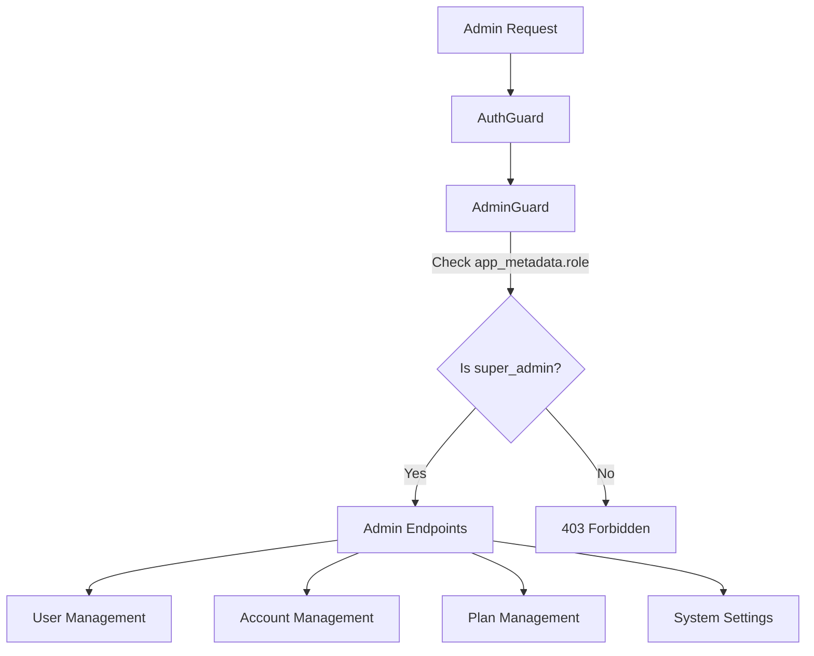

# Super Admin Panel

> Status: Production-ready  
> Stack: Next.js, NestJS, AdminGuard, Supabase  
> Related Docs: [Authentication](./authentication-authorization.md), [User Management](./user-management.md), [Multi-Tenancy](./multi-tenancy.md)

## Overview & Key Concepts

The scaffold includes a comprehensive **Super Admin Panel** for managing users, accounts, projects, plans, and system settings. Access is restricted to users with the `super_admin` role via the AdminGuard.

### Key Features

- User Management (view, approve, suspend, promote)
- Account Management (view all accounts, search)
- Project Management (cross-account overview)
- Plan Management (create/edit plans, pricing, features)
- System Settings (multi-tenancy, theme)
- Global Search (admin command menu)

### Architecture



## Implementation Details

### Directory Structure

```
frontend/src/app/admin/
├── layout.tsx                    # Admin layout with sidebar
├── page.tsx                      # Admin dashboard
├── users/
│   ├── page.tsx                  # User list
│   ├── user-sheet.tsx            # User details drawer
│   └── user-table.tsx            # Data table
├── accounts/
│   ├── page.tsx                  # Account list
│   └── account-table.tsx
├── projects/
│   ├── page.tsx                  # Project list
│   └── project-table.tsx
├── plans/
│   ├── page.tsx                  # Plan management
│   ├── plan-form.tsx             # Create/edit plan
│   └── plan-card.tsx
└── settings/
    ├── page.tsx                  # System settings
    └── appearance/
        └── page.tsx              # Theme settings

backend/src/
├── users/
│   └── admin-users.controller.ts
├── accounts/
│   └── admin-accounts.controller.ts
├── projects/
│   └── admin-projects.controller.ts
├── plans/
│   └── plans.controller.ts
└── system-settings/
    └── system-settings.controller.ts
```

### AdminGuard Implementation

```typescript
// backend/src/common/guards/admin.guard.ts
@Injectable()
export class AdminGuard implements CanActivate {
  canActivate(context: ExecutionContext): boolean {
    const request = context.switchToHttp().getRequest();
    const user = request.user; // Set by AuthGuard

    const role = user.app_metadata?.role;

    if (role !== UserRole.SUPER_ADMIN) {
      throw new ForbiddenException('Access denied. Requires SUPER_ADMIN role.');
    }

    return true;
  }
}
```

### Admin Endpoints

#### User Management Controller

```typescript
@Controller('admin/users')
@UseGuards(AuthGuard, AdminGuard)
export class AdminUsersController {
  @Get()
  async listUsers(
    @Query('page') page: number = 1,
    @Query('limit') limit: number = 10,
    @Query('search') search?: string,
    @Query('status') status?: string,
  ) {
    return this.usersService.findAllUsers(page, limit, search, status);
  }

  @Get(':id')
  async getUserDetails(@Param('id') userId: string) {
    return this.usersService.getUserDetailsAdmin(userId);
  }

  @Patch(':id/status')
  async updateStatus(
    @Param('id') userId: string,
    @Body() dto: UpdateStatusDto,
  ) {
    return this.usersService.updateUserStatus(userId, dto.status);
  }

  @Patch(':id/role')
  async updateRole(
    @Param('id') userId: string,
    @Body() dto: UpdateRoleDto,
  ) {
    return this.usersService.updateUserRole(userId, dto.role);
  }

  @Delete(':id')
  async deleteUser(@Param('id') userId: string) {
    return this.usersService.deleteUser(userId);
  }
}
```

### Frontend Admin Layout

```typescript
// frontend/src/app/admin/layout.tsx
export default async function AdminLayout({ children }: Props) {
  const user = await getUser();

  // Check if user is super admin
  if (user.app_metadata?.role !== 'super_admin') {
    redirect('/dashboard');
  }

  return (
    <div className="flex h-screen">
      <AdminSidebar />
      <main className="flex-1 overflow-y-auto p-8">
        {children}
      </main>
    </div>
  );
}
```

### Admin Sidebar Component

```typescript
export function AdminSidebar() {
  return (
    <aside className="w-64 border-r bg-muted/40">
      <div className="p-6">
        <h2 className="text-lg font-semibold">Admin Panel</h2>
      </div>
      <nav className="space-y-1 px-3">
        <NavLink href="/admin" icon={LayoutDashboard}>
          Dashboard
        </NavLink>
        <NavLink href="/admin/users" icon={Users}>
          Users
        </NavLink>
        <NavLink href="/admin/accounts" icon={Building}>
          Accounts
        </NavLink>
        <NavLink href="/admin/projects" icon={FolderKanban}>
          Projects
        </NavLink>
        <NavLink href="/admin/plans" icon={CreditCard}>
          Plans
        </NavLink>
        <NavLink href="/admin/settings" icon={Settings}>
          Settings
        </NavLink>
      </nav>
    </aside>
  );
}
```

### User Management Page

```typescript
// frontend/src/app/admin/users/page.tsx
export default async function AdminUsersPage({ searchParams }: Props) {
  const page = Number(searchParams.page) || 1;
  const search = searchParams.search || '';
  const status = searchParams.status || '';

  const response = await fetch(
    `${API_URL}/admin/users?page=${page}&search=${search}&status=${status}`,
    {
      headers: {
        Authorization: `Bearer ${token}`,
      },
    }
  );

  const { data: users, meta } = await response.json();

  return (
    <div>
      <div className="flex justify-between items-center mb-6">
        <h1 className="text-3xl font-bold">Users</h1>
        <div className="flex gap-2">
          <Input
            placeholder="Search users..."
            defaultValue={search}
            onChange={(e) => {
              // Update search param
            }}
          />
          <Select value={status} onValueChange={handleStatusFilter}>
            <SelectItem value="">All</SelectItem>
            <SelectItem value="active">Active</SelectItem>
            <SelectItem value="pending">Pending</SelectItem>
            <SelectItem value="suspended">Suspended</SelectItem>
          </Select>
        </div>
      </div>

      <DataTable
        columns={userColumns}
        data={users}
        pagination={{
          page: meta.page,
          totalPages: meta.totalPages,
        }}
      />
    </div>
  );
}
```

### User Details Sheet

```typescript
export function UserSheet({ userId, open, onClose }: Props) {
  const [user, setUser] = useState(null);

  useEffect(() => {
    if (open) {
      fetchUserDetails(userId).then(setUser);
    }
  }, [open, userId]);

  async function handleApprove() {
    await fetch(`${API_URL}/admin/users/${userId}/status`, {
      method: 'PATCH',
      body: JSON.stringify({ status: 'active' }),
    });
    toast.success('User approved');
    onClose();
  }

  async function handleSuspend() {
    await fetch(`${API_URL}/admin/users/${userId}/status`, {
      method: 'PATCH',
      body: JSON.stringify({ status: 'suspended' }),
    });
    toast.success('User suspended');
    onClose();
  }

  return (
    <Sheet open={open} onOpenChange={onClose}>
      <SheetContent>
        <SheetHeader>
          <SheetTitle>User Details</SheetTitle>
        </SheetHeader>
        
        <div className="space-y-4 mt-6">
          <div>
            <Label>Name</Label>
            <p>{user?.name}</p>
          </div>
          
          <div>
            <Label>Email</Label>
            <p>{user?.email}</p>
          </div>
          
          <div>
            <Label>Status</Label>
            <Badge variant={user?.status === 'active' ? 'success' : 'warning'}>
              {user?.status}
            </Badge>
          </div>
          
          <div>
            <Label>Linked Accounts</Label>
            <ul>
              {user?.linkedAccounts?.map((account) => (
                <li key={account.id}>
                  {account.name} ({account.role})
                </li>
              ))}
            </ul>
          </div>

          <div className="flex gap-2">
            {user?.status === 'pending' && (
              <Button onClick={handleApprove}>Approve</Button>
            )}
            {user?.status === 'active' && (
              <Button variant="destructive" onClick={handleSuspend}>
                Suspend
              </Button>
            )}
          </div>
        </div>
      </SheetContent>
    </Sheet>
  );
}
```

### Plan Management Page

```typescript
export default function AdminPlansPage() {
  const [plans, setPlans] = useState([]);
  const [editingPlan, setEditingPlan] = useState(null);

  async function handleCreatePlan(data: PlanFormData) {
    await fetch(`${API_URL}/admin/plans`, {
      method: 'POST',
      body: JSON.stringify(data),
    });
    
    toast.success('Plan created');
    loadPlans();
  }

  async function handleUpdatePlan(id: string, data: PlanFormData) {
    await fetch(`${API_URL}/admin/plans/${id}`, {
      method: 'PATCH',
      body: JSON.stringify(data),
    });
    
    toast.success('Plan updated');
    loadPlans();
  }

  return (
    <div>
      <div className="flex justify-between items-center mb-6">
        <h1 className="text-3xl font-bold">Plans</h1>
        <Button onClick={() => setEditingPlan({})}>
          Create Plan
        </Button>
      </div>

      <div className="grid grid-cols-3 gap-6">
        {plans.map((plan) => (
          <PlanCard
            key={plan.id}
            plan={plan}
            onEdit={() => setEditingPlan(plan)}
          />
        ))}
      </div>

      {editingPlan && (
        <PlanFormDialog
          plan={editingPlan}
          onSave={editingPlan.id ? handleUpdatePlan : handleCreatePlan}
          onClose={() => setEditingPlan(null)}
        />
      )}
    </div>
  );
}
```

### System Settings Page

```typescript
export default function AdminSettingsPage() {
  const [settings, setSettings] = useState(null);

  async function handleSave(updates: Partial<SystemSettings>) {
    await fetch(`${API_URL}/admin/settings`, {
      method: 'PATCH',
      body: JSON.stringify(updates),
    });

    toast.success('Settings updated');
  }

  return (
    <div>
      <h1 className="text-3xl font-bold mb-6">System Settings</h1>

      <Card>
        <CardHeader>
          <CardTitle>Multi-Tenancy</CardTitle>
        </CardHeader>
        <CardContent className="space-y-4">
          <div className="flex items-center justify-between">
            <Label>Allow Multiple Teams</Label>
            <Switch
              checked={settings?.allow_multiple_teams}
              onCheckedChange={(checked) =>
                handleSave({ allow_multiple_teams: checked })
              }
            />
          </div>

          <div className="flex items-center justify-between">
            <Label>Allow Multiple Projects</Label>
            <Switch
              checked={settings?.allow_multiple_projects}
              onCheckedChange={(checked) =>
                handleSave({ allow_multiple_projects: checked })
              }
            />
          </div>
        </CardContent>
      </Card>
    </div>
  );
}
```

### Admin Command Menu

```typescript
export function AdminCommandMenu() {
  const [open, setOpen] = useState(false);

  useEffect(() => {
    const down = (e: KeyboardEvent) => {
      if (e.key === 'k' && (e.metaKey || e.ctrlKey)) {
        e.preventDefault();
        setOpen(true);
      }
    };

    document.addEventListener('keydown', down);
    return () => document.removeEventListener('keydown', down);
  }, []);

  return (
    <CommandDialog open={open} onOpenChange={setOpen}>
      <CommandInput placeholder="Search..." />
      <CommandList>
        <CommandGroup heading="Users">
          <CommandItem onSelect={() => router.push('/admin/users')}>
            View All Users
          </CommandItem>
          <CommandItem onSelect={() => router.push('/admin/users?status=pending')}>
            Pending Approvals
          </CommandItem>
        </CommandGroup>

        <CommandGroup heading="Accounts">
          <CommandItem onSelect={() => router.push('/admin/accounts')}>
            View All Accounts
          </CommandItem>
        </CommandGroup>

        <CommandGroup heading="Settings">
          <CommandItem onSelect={() => router.push('/admin/settings')}>
            System Settings
          </CommandItem>
          <CommandItem onSelect={() => router.push('/admin/settings/appearance')}>
            Appearance
          </CommandItem>
        </CommandGroup>
      </CommandList>
    </CommandDialog>
  );
}
```

## Configuration

### Promoting User to Super Admin

```sql
-- Via SQL
UPDATE auth.users
SET raw_app_meta_data = 
  COALESCE(raw_app_meta_data, '{}'::jsonb) || '{"role": "super_admin"}'::jsonb
WHERE email = 'admin@example.com';
```

```typescript
// Via Admin API
await supabase.auth.admin.updateUserById(userId, {
  app_metadata: { role: 'super_admin' },
});
```

## Best Practices

### 1. Always Use Both Guards

✅ **Good**: AuthGuard + AdminGuard
```typescript
@Controller('admin/users')
@UseGuards(AuthGuard, AdminGuard)
export class AdminUsersController {}
```

❌ **Bad**: AdminGuard only
```typescript
@UseGuards(AdminGuard)  // Won't have req.user!
```

### 2. Check Admin Role in Frontend

✅ **Good**: Server-side check
```typescript
export default async function AdminLayout({ children }: Props) {
  const user = await getUser();
  
  if (user.app_metadata?.role !== 'super_admin') {
    redirect('/dashboard');
  }

  return <>{children}</>;
}
```

### 3. Audit Admin Actions

```typescript
async function logAdminAction(action: string, userId: string, details: any) {
  await supabase.from('admin_audit_log').insert({
    action,
    admin_user_id: userId,
    details,
    timestamp: new Date(),
  });
}
```

## Extension Guide

### Adding Audit Log

```sql
CREATE TABLE admin_audit_log (
  id uuid PRIMARY KEY DEFAULT uuid_generate_v4(),
  admin_user_id uuid REFERENCES users(id),
  action text NOT NULL,
  entity_type text,
  entity_id uuid,
  details jsonb,
  created_at timestamptz DEFAULT now()
);

CREATE INDEX idx_audit_admin ON admin_audit_log(admin_user_id);
CREATE INDEX idx_audit_created ON admin_audit_log(created_at DESC);
```

### Adding Admin Roles

```typescript
export enum AdminRole {
  SUPER_ADMIN = 'super_admin',
  ADMIN = 'admin',
  MODERATOR = 'moderator',
}

// Different permissions per role
const permissions = {
  super_admin: ['*'],
  admin: ['users.read', 'users.update', 'accounts.read'],
  moderator: ['users.read', 'content.moderate'],
};
```

## Troubleshooting

**Q: Can't access admin panel**

A: Check user role:
```sql
SELECT email, raw_app_meta_data->>'role' as role
FROM auth.users
WHERE email = 'your@email.com';
```

**Q: Admin endpoints return 403**

A: Ensure both guards are applied:
```typescript
@UseGuards(AuthGuard, AdminGuard)  // Both required
```

## Related Documentation

- [Authentication & Authorization](./authentication-authorization.md)
- [User Management](./user-management.md)
- [Multi-Tenancy](./multi-tenancy.md)
- [Backend Architecture](./backend-architecture.md)
