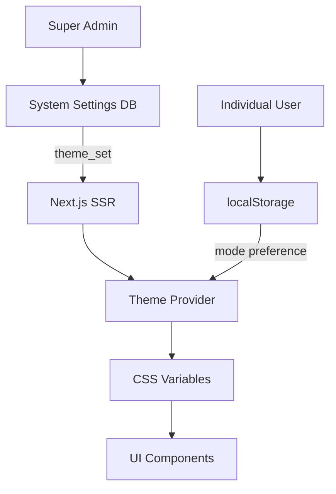

# Advanced Theming System

> Status: Production-ready  
> Stack: CSS Variables, Next.js, Tailwind CSS, localStorage  
> Related Docs: [Super Admin Panel](./super-admin-panel.md), [UI Components](./ui-components.md)

## Overview & Key Concepts

The scaffold features an **advanced theming system** with 8 pre-built theme sets, dark/light/system modes, and real-time theme switching without page reloads. Themes are managed at two levels: system-wide theme set (admin-controlled) and individual user mode preference (client-side).

### Key Concepts

- **Theme Set**: Color palette and design system (Corporate, Modern, Ocean, etc.)
- **Theme Mode**: Light, dark, or system (follows OS preference)
- **CSS Variables**: Dynamic color system using CSS custom properties
- **Two-Level Management**: Global theme set + individual mode preference
- **Real-Time Switching**: No page reload required

### Architecture



## Implementation Details

### Directory Structure

```
frontend/src/
├── theme/
│   ├── sets/
│   │   ├── corporate.ts
│   │   ├── modern.ts
│   │   ├── ocean.ts
│   │   ├── forest.ts
│   │   ├── sunset.ts
│   │   ├── midnight.ts
│   │   ├── lavender.ts
│   │   └── monochrome.ts
│   ├── themeConfig.ts        # Theme registry
│   ├── theme.types.ts        # TypeScript types
│   └── theme.constants.ts    # Constants
├── components/
│   └── theme/
│       ├── theme-provider.tsx
│       └── theme-selector.tsx
└── app/
    └── admin/
        └── settings/
            └── appearance/
                └── page.tsx   # Theme management UI

backend/src/
└── system-settings/
    └── system-settings.service.ts  # Persist theme_set
```

### Theme Structure

```typescript
export interface ThemeColors {
  // Background colors
  background: string;
  foreground: string;
  
  // Card colors
  card: string;
  cardForeground: string;
  
  // UI element colors
  popover: string;
  popoverForeground: string;
  
  // Primary brand color
  primary: string;
  primaryForeground: string;
  
  // Secondary color
  secondary: string;
  secondaryForeground: string;
  
  // Muted colors
  muted: string;
  mutedForeground: string;
  
  // Accent color
  accent: string;
  accentForeground: string;
  
  // Destructive actions
  destructive: string;
  destructiveForeground: string;
  
  // Border and input
  border: string;
  input: string;
  ring: string;
  
  // Chart colors (optional)
  chart1?: string;
  chart2?: string;
  chart3?: string;
  chart4?: string;
  chart5?: string;
}

export interface ThemeSet {
  id: string;
  name: string;
  light: ThemeColors;
  dark: ThemeColors;
}
```

### Theme Registry (`themeConfig.ts`)

```typescript
import { corporate } from './sets/corporate';
import { modern } from './sets/modern';
// ... other imports

export const themes: Record<string, ThemeSet> = {
  corporate,
  modern,
  ocean,
  forest,
  sunset,
  midnight,
  lavender,
  monochrome,
};

export const defaultTheme = 'corporate';

export function getThemeSet(id: string): ThemeSet {
  return themes[id] || themes[defaultTheme];
}
```

### Example Theme Set (`corporate.ts`)

```typescript
export const corporate: ThemeSet = {
  id: 'corporate',
  name: 'Corporate',
  light: {
    background: '0 0% 100%',
    foreground: '222.2 84% 4.9%',
    card: '0 0% 100%',
    cardForeground: '222.2 84% 4.9%',
    primary: '221.2 83.2% 53.3%',
    primaryForeground: '210 40% 98%',
    secondary: '210 40% 96.1%',
    secondaryForeground: '222.2 47.4% 11.2%',
    muted: '210 40% 96.1%',
    mutedForeground: '215.4 16.3% 46.9%',
    accent: '210 40% 96.1%',
    accentForeground: '222.2 47.4% 11.2%',
    destructive: '0 84.2% 60.2%',
    destructiveForeground: '210 40% 98%',
    border: '214.3 31.8% 91.4%',
    input: '214.3 31.8% 91.4%',
    ring: '221.2 83.2% 53.3%',
  },
  dark: {
    background: '222.2 84% 4.9%',
    foreground: '210 40% 98%',
    card: '222.2 84% 4.9%',
    cardForeground: '210 40% 98%',
    primary: '217.2 91.2% 59.8%',
    primaryForeground: '222.2 47.4% 11.2%',
    secondary: '217.2 32.6% 17.5%',
    secondaryForeground: '210 40% 98%',
    muted: '217.2 32.6% 17.5%',
    mutedForeground: '215 20.2% 65.1%',
    accent: '217.2 32.6% 17.5%',
    accentForeground: '210 40% 98%',
    destructive: '0 62.8% 30.6%',
    destructiveForeground: '210 40% 98%',
    border: '217.2 32.6% 17.5%',
    input: '217.2 32.6% 17.5%',
    ring: '224.3 76.3% 48%',
  },
};
```

### Theme Provider Component

```typescript
'use client';

export function ThemeProvider({ themeSet, children }: Props) {
  const [mode, setMode] = useState<'light' | 'dark' | 'system'>('system');
  const [resolvedMode, setResolvedMode] = useState<'light' | 'dark'>('light');

  useEffect(() => {
    // Load mode from localStorage
    const savedMode = localStorage.getItem('theme-mode');
    if (savedMode) {
      setMode(savedMode as any);
    }
  }, []);

  useEffect(() => {
    // Resolve system mode
    if (mode === 'system') {
      const mediaQuery = window.matchMedia('(prefers-color-scheme: dark)');
      setResolvedMode(mediaQuery.matches ? 'dark' : 'light');

      const handler = (e: MediaQueryListEvent) => {
        setResolvedMode(e.matches ? 'dark' : 'light');
      };

      mediaQuery.addEventListener('change', handler);
      return () => mediaQuery.removeEventListener('change', handler);
    } else {
      setResolvedMode(mode);
    }
  }, [mode]);

  useEffect(() => {
    // Apply CSS variables
    const theme = getThemeSet(themeSet);
    const colors = theme[resolvedMode];

    const root = document.documentElement;
    Object.entries(colors).forEach(([key, value]) => {
      root.style.setProperty(`--${kebabCase(key)}`, value);
    });

    // Update class
    root.classList.remove('light', 'dark');
    root.classList.add(resolvedMode);
  }, [themeSet, resolvedMode]);

  return (
    <ThemeContext.Provider value={{ mode, setMode, themeSet }}>
      {children}
    </ThemeContext.Provider>
  );
}
```

### Theme Selector Component

```typescript
export function ThemeSelector() {
  const { mode, setMode, themeSet } = useTheme();
  const [selectedThemeSet, setSelectedThemeSet] = useState(themeSet);

  async function updateThemeSet(newThemeSet: string) {
    // Update in database (admin only)
    await fetch(`${API_URL}/admin/settings`, {
      method: 'PATCH',
      body: JSON.stringify({ theme_set: newThemeSet }),
    });

    setSelectedThemeSet(newThemeSet);
    window.location.reload(); // Reload to apply new theme set
  }

  function updateMode(newMode: 'light' | 'dark' | 'system') {
    setMode(newMode);
    localStorage.setItem('theme-mode', newMode);
  }

  return (
    <div>
      <Label>Theme Set</Label>
      <Select value={selectedThemeSet} onValueChange={updateThemeSet}>
        {Object.values(themes).map((theme) => (
          <SelectItem key={theme.id} value={theme.id}>
            {theme.name}
          </SelectItem>
        ))}
      </Select>

      <Label>Mode</Label>
      <ToggleGroup value={mode} onValueChange={updateMode}>
        <ToggleGroupItem value="light">Light</ToggleGroupItem>
        <ToggleGroupItem value="dark">Dark</ToggleGroupItem>
        <ToggleGroupItem value="system">System</ToggleGroupItem>
      </ToggleGroup>
    </div>
  );
}
```

## Configuration

### Fetching Theme Set on SSR

```typescript
// app/layout.tsx
export default async function RootLayout({ children }: Props) {
  // Fetch theme set from database
  const response = await fetch(`${API_URL}/system-settings/theme`);
  const { theme_set } = await response.json();

  return (
    <html suppressHydrationWarning>
      <body>
        <ThemeProvider themeSet={theme_set}>
          {children}
        </ThemeProvider>
      </body>
    </html>
  );
}
```

### Backend Theme Persistence

```typescript
@Injectable()
export class SystemSettingsService {
  async getThemeSettings(): Promise<{ theme_set: string }> {
    const { data } = await this.supabase
      .from('system_settings')
      .select('theme_set')
      .single();

    return { theme_set: data?.theme_set || 'corporate' };
  }

  async updateSettings(dto: UpdateSettingsDto) {
    await this.supabase
      .from('system_settings')
      .upsert({
        id: true,
        theme_set: dto.theme_set,
        updated_at: new Date().toISOString(),
      });
  }
}
```

## Best Practices

### 1. Use Theme Variables in CSS

✅ **Good**: Use CSS variables
```css
.my-component {
  background-color: hsl(var(--background));
  color: hsl(var(--foreground));
  border: 1px solid hsl(var(--border));
}
```

❌ **Bad**: Hardcoded colors
```css
.my-component {
  background-color: #ffffff;
  color: #000000;
}
```

### 2. Use Tailwind Theme Classes

✅ **Good**: Semantic classes
```tsx
<div className="bg-background text-foreground border border-border">
  <Button className="bg-primary text-primary-foreground">
    Submit
  </Button>
</div>
```

### 3. Provide Theme Preview

```typescript
function ThemePreview({ themeSet, mode }: Props) {
  const theme = getThemeSet(themeSet);
  const colors = theme[mode];

  return (
    <div style={{
      background: `hsl(${colors.background})`,
      color: `hsl(${colors.foreground})`,
    }}>
      <div style={{ background: `hsl(${colors.primary})` }}>
        Primary Button
      </div>
      <div style={{ background: `hsl(${colors.secondary})` }}>
        Secondary Button
      </div>
    </div>
  );
}
```

## Extension Guide

### Creating Custom Theme Set

1. **Create theme file:**
```typescript
// frontend/src/theme/sets/custom.ts
export const custom: ThemeSet = {
  id: 'custom',
  name: 'Custom',
  light: {
    background: '0 0% 100%',
    foreground: '0 0% 0%',
    primary: '180 100% 50%',
    // ... other colors
  },
  dark: {
    // ... dark mode colors
  },
};
```

2. **Register in themeConfig.ts:**
```typescript
import { custom } from './sets/custom';

export const themes = {
  // ... existing themes
  custom,
};
```

### Making Theme Mode Per-User

```sql
-- Add to users table
ALTER TABLE users ADD COLUMN theme_mode text DEFAULT 'system';
```

```typescript
// Load from database instead of localStorage
const { data: user } = await supabase
  .from('users')
  .select('theme_mode')
  .eq('id', userId)
  .single();

setMode(user.theme_mode);
```

## Troubleshooting

**Q: Theme not updating after change**

A: Check if CSS variables are applied:
```javascript
console.log(getComputedStyle(document.documentElement).getPropertyValue('--background'));
```

**Q: Flash of wrong theme on page load**

A: Use `suppressHydrationWarning` and set initial theme via script:
```html
<script>
  const theme = localStorage.getItem('theme-mode') || 'system';
  document.documentElement.classList.add(theme);
</script>
```

## Related Documentation

- [Super Admin Panel](./super-admin-panel.md)
- [UI Components](./ui-components.md)
- [Backend Architecture](./backend-architecture.md)
