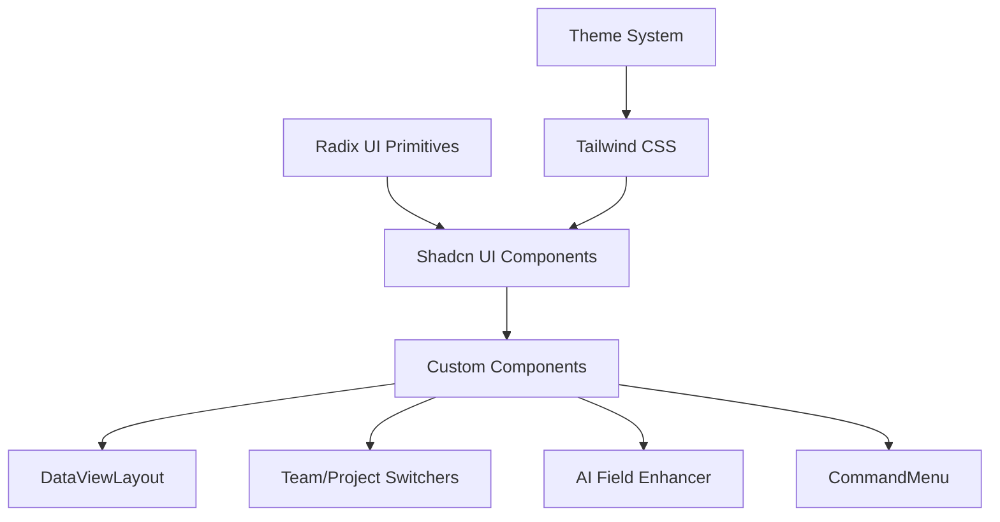

# UI Components & Design System

> Status: Production-ready  
> Stack: Shadcn UI, Tailwind CSS, Radix UI, Lucide Icons  
> Related Docs: [Theming System](./theming-system.md), [Internationalization](./internationalization.md)

## Overview & Key Concepts

The scaffold includes a comprehensive library of reusable UI components built on Shadcn UI and Radix UI primitives, with custom components for common patterns like data views, navigation, and AI-enhanced inputs.

### Key Components

- **DataViewLayout**: Universal grid/list pattern for collections
- **Team/Project Switchers**: Context navigation components
- **AI Field Enhancer**: AI-powered input enhancement
- **Command Menu**: Keyboard-driven navigation (Cmd+K)
- **Shadcn Base Components**: 38+ pre-styled components

### Architecture



## Implementation Details

### Directory Structure

```
frontend/src/
├── components/
│   ├── ui/                       # Shadcn base components
│   │   ├── button.tsx
│   │   ├── input.tsx
│   │   ├── card.tsx
│   │   ├── dialog.tsx
│   │   ├── dropdown-menu.tsx
│   │   ├── select.tsx
│   │   ├── table.tsx
│   │   └── ... (38 total)
│   ├── data-view-layout.tsx      # Universal data view
│   ├── team-switcher.tsx         # Account navigation
│   ├── nav-projects.tsx          # Project navigation
│   ├── admin-command-menu.tsx    # Admin quick actions
│   └── brand-logo.tsx            # Logo component
├── features/
│   └── ai/
│       └── components/
│           └── field-enhancer.tsx # AI input enhancement
└── kit/
    ├── shadcn/                   # Extended Shadcn components
    └── makerkit/                 # Makerkit components
```

### DataViewLayout Component

**Purpose**: Universal pattern for displaying collections in grid or list view with filtering, sorting, and pagination.

```typescript
// frontend/src/components/data-view-layout.tsx
interface DataViewLayoutProps<T> {
  items: T[];
  renderCard: (item: T) => React.ReactNode;
  renderListItem: (item: T) => React.ReactNode;
  emptyState?: React.ReactNode;
  filters?: React.ReactNode;
  actions?: React.ReactNode;
  defaultView?: 'grid' | 'list';
}

export function DataViewLayout<T>({
  items,
  renderCard,
  renderListItem,
  emptyState,
  filters,
  actions,
  defaultView = 'grid',
}: DataViewLayoutProps<T>) {
  const [view, setView] = useState<'grid' | 'list'>(defaultView);

  return (
    <div className="space-y-4">
      {/* Header */}
      <div className="flex justify-between items-center">
        <div className="flex gap-2">
          {filters}
        </div>
        <div className="flex gap-2">
          {actions}
          <ToggleGroup value={view} onValueChange={setView}>
            <ToggleGroupItem value="grid">
              <LayoutGrid className="h-4 w-4" />
            </ToggleGroupItem>
            <ToggleGroupItem value="list">
              <List className="h-4 w-4" />
            </ToggleGroupItem>
          </ToggleGroup>
        </div>
      </div>

      {/* Content */}
      {items.length === 0 ? (
        emptyState || <EmptyState />
      ) : view === 'grid' ? (
        <div className="grid grid-cols-1 md:grid-cols-2 lg:grid-cols-3 gap-4">
          {items.map((item, index) => (
            <div key={index}>{renderCard(item)}</div>
          ))}
        </div>
      ) : (
        <div className="space-y-2">
          {items.map((item, index) => (
            <div key={index}>{renderListItem(item)}</div>
          ))}
        </div>
      )}
    </div>
  );
}
```

**Usage Example:**
```typescript
export function ProjectsPage({ projects }: Props) {
  return (
    <DataViewLayout
      items={projects}
      renderCard={(project) => (
        <Card>
          <CardHeader>
            <CardTitle>{project.name}</CardTitle>
            <CardDescription>{project.description}</CardDescription>
          </CardHeader>
          <CardFooter>
            <Button asChild>
              <Link href={`/projects/${project.id}`}>Open</Link>
            </Button>
          </CardFooter>
        </Card>
      )}
      renderListItem={(project) => (
        <div className="flex items-center justify-between p-4 border rounded-lg">
          <div>
            <h3 className="font-semibold">{project.name}</h3>
            <p className="text-sm text-muted-foreground">{project.description}</p>
          </div>
          <Button asChild>
            <Link href={`/projects/${project.id}`}>Open</Link>
          </Button>
        </div>
      )}
      filters={
        <>
          <Input placeholder="Search projects..." />
          <Select>
            <SelectItem value="all">All</SelectItem>
            <SelectItem value="active">Active</SelectItem>
          </Select>
        </>
      }
      actions={
        <Button>
          <Plus className="h-4 w-4 mr-2" />
          New Project
        </Button>
      }
    />
  );
}
```

### Team Switcher Component

```typescript
export function TeamSwitcher({ teams, activeTeam }: Props) {
  return (
    <DropdownMenu>
      <DropdownMenuTrigger asChild>
        <Button variant="outline" className="w-full justify-between">
          <div className="flex items-center gap-2">
            <Building className="h-4 w-4" />
            <div className="text-left">
              <div className="font-medium">{activeTeam.name}</div>
              <div className="text-xs text-muted-foreground">
                {activeTeam.plan}
              </div>
            </div>
          </div>
          <ChevronsUpDown className="h-4 w-4 opacity-50" />
        </Button>
      </DropdownMenuTrigger>
      <DropdownMenuContent align="start" className="w-[240px]">
        <DropdownMenuLabel>Teams</DropdownMenuLabel>
        <DropdownMenuSeparator />
        {teams.map((team) => (
          <DropdownMenuItem
            key={team.id}
            onClick={() => switchAccount(team.id)}
          >
            <Check
              className={cn(
                'mr-2 h-4 w-4',
                activeTeam.id === team.id ? 'opacity-100' : 'opacity-0'
              )}
            />
            {team.name}
          </DropdownMenuItem>
        ))}
        <DropdownMenuSeparator />
        <DropdownMenuItem>
          <Plus className="mr-2 h-4 w-4" />
          Create Team
        </DropdownMenuItem>
      </DropdownMenuContent>
    </DropdownMenu>
  );
}
```

### AI Field Enhancer Component

```typescript
export function AIFieldEnhancer({ field, onEnhance }: Props) {
  const [isEnhancing, setIsEnhancing] = useState(false);

  async function handleEnhance() {
    setIsEnhancing(true);
    
    const response = await fetch(`${API_URL}/ai-assistant/enhance`, {
      method: 'POST',
      body: JSON.stringify({
        field: field.name,
        value: field.value,
      }),
    });

    const { enhanced } = await response.json();
    onEnhance(enhanced);
    setIsEnhancing(false);
  }

  return (
    <Button
      variant="ghost"
      size="sm"
      onClick={handleEnhance}
      disabled={isEnhancing}
    >
      {isEnhancing ? (
        <>
          <Loader2 className="h-4 w-4 mr-2 animate-spin" />
          Enhancing...
        </>
      ) : (
        <>
          <Sparkles className="h-4 w-4 mr-2" />
          Enhance with AI
        </>
      )}
    </Button>
  );
}
```

### Command Menu Component

```typescript
export function CommandMenu() {
  const [open, setOpen] = useState(false);
  const router = useRouter();

  useEffect(() => {
    const down = (e: KeyboardEvent) => {
      if (e.key === 'k' && (e.metaKey || e.ctrlKey)) {
        e.preventDefault();
        setOpen((open) => !open);
      }
    };

    document.addEventListener('keydown', down);
    return () => document.removeEventListener('keydown', down);
  }, []);

  return (
    <CommandDialog open={open} onOpenChange={setOpen}>
      <CommandInput placeholder="Type a command or search..." />
      <CommandList>
        <CommandEmpty>No results found.</CommandEmpty>
        
        <CommandGroup heading="Quick Actions">
          <CommandItem onSelect={() => router.push('/projects/new')}>
            <Plus className="mr-2 h-4 w-4" />
            New Project
          </CommandItem>
          <CommandItem onSelect={() => router.push('/settings/team')}>
            <Users className="mr-2 h-4 w-4" />
            Invite Team Member
          </CommandItem>
        </CommandGroup>

        <CommandGroup heading="Navigation">
          <CommandItem onSelect={() => router.push('/dashboard')}>
            <LayoutDashboard className="mr-2 h-4 w-4" />
            Dashboard
          </CommandItem>
          <CommandItem onSelect={() => router.push('/projects')}>
            <FolderKanban className="mr-2 h-4 w-4" />
            Projects
          </CommandItem>
          <CommandItem onSelect={() => router.push('/settings')}>
            <Settings className="mr-2 h-4 w-4" />
            Settings
          </CommandItem>
        </CommandGroup>
      </CommandList>
    </CommandDialog>
  );
}
```

### Common Shadcn Components

#### Button Component
```typescript
<Button variant="default">Default</Button>
<Button variant="destructive">Delete</Button>
<Button variant="outline">Outline</Button>
<Button variant="ghost">Ghost</Button>
<Button size="sm">Small</Button>
<Button size="lg">Large</Button>
```

#### Card Component
```typescript
<Card>
  <CardHeader>
    <CardTitle>Card Title</CardTitle>
    <CardDescription>Card description</CardDescription>
  </CardHeader>
  <CardContent>
    Content goes here
  </CardContent>
  <CardFooter>
    <Button>Action</Button>
  </CardFooter>
</Card>
```

#### Dialog Component
```typescript
<Dialog>
  <DialogTrigger asChild>
    <Button>Open Dialog</Button>
  </DialogTrigger>
  <DialogContent>
    <DialogHeader>
      <DialogTitle>Dialog Title</DialogTitle>
      <DialogDescription>Dialog description</DialogDescription>
    </DialogHeader>
    <div>Content</div>
    <DialogFooter>
      <Button>Save</Button>
    </DialogFooter>
  </DialogContent>
</Dialog>
```

#### Table Component
```typescript
<Table>
  <TableHeader>
    <TableRow>
      <TableHead>Name</TableHead>
      <TableHead>Email</TableHead>
      <TableHead>Role</TableHead>
    </TableRow>
  </TableHeader>
  <TableBody>
    {users.map((user) => (
      <TableRow key={user.id}>
        <TableCell>{user.name}</TableCell>
        <TableCell>{user.email}</TableCell>
        <TableCell>{user.role}</TableCell>
      </TableRow>
    ))}
  </TableBody>
</Table>
```

## Best Practices

### 1. Use Composition Over Customization

✅ **Good**: Compose components
```typescript
<Card>
  <CardHeader>
    <div className="flex justify-between">
      <CardTitle>Title</CardTitle>
      <Button variant="ghost" size="sm">
        <MoreVertical />
      </Button>
    </div>
  </CardHeader>
  <CardContent>Content</CardContent>
</Card>
```

❌ **Bad**: Modifying component source
```typescript
// Don't edit components/ui/card.tsx directly
```

### 2. Use Theme Variables

✅ **Good**: Semantic colors
```typescript
<div className="bg-background text-foreground border-border">
  <Button className="bg-primary text-primary-foreground">
    Submit
  </Button>
</div>
```

### 3. Leverage DataViewLayout

✅ **Good**: Reuse pattern
```typescript
<DataViewLayout
  items={items}
  renderCard={renderCard}
  renderListItem={renderListItem}
/>
```

❌ **Bad**: Duplicate grid/list logic
```typescript
{view === 'grid' ? (
  <div className="grid...">{/* ... */}</div>
) : (
  <div className="space-y...">{/* ... */}</div>
)}
```

## Extension Guide

### Adding New Shadcn Component

```bash
npx shadcn-ui@latest add badge
```

This adds `components/ui/badge.tsx` to your project.

### Creating Custom Component

```typescript
// components/status-badge.tsx
import { Badge } from '@/components/ui/badge';

export function StatusBadge({ status }: Props) {
  const variants = {
    active: 'success',
    pending: 'warning',
    suspended: 'destructive',
  };

  return (
    <Badge variant={variants[status]}>
      {status}
    </Badge>
  );
}
```

### Extending DataViewLayout

```typescript
interface ExtendedDataViewProps<T> extends DataViewLayoutProps<T> {
  onSort?: (field: string) => void;
  onFilter?: (filters: Record<string, any>) => void;
  pagination?: {
    page: number;
    totalPages: number;
    onPageChange: (page: number) => void;
  };
}
```

## Troubleshooting

**Q: Component styles not applying**

A: Check Tailwind config includes component paths:
```javascript
// tailwind.config.ts
content: [
  './src/components/**/*.{ts,tsx}',
  './src/app/**/*.{ts,tsx}',
],
```

**Q: Icons not showing**

A: Install Lucide React:
```bash
npm install lucide-react
```

## Related Documentation

- [Theming System](./theming-system.md)
- [Internationalization](./internationalization.md)
- [Frontend Architecture](./frontend-architecture.md)

### External Resources

- [Shadcn UI Documentation](https://ui.shadcn.com/)
- [Radix UI Documentation](https://www.radix-ui.com/)
- [Lucide Icons](https://lucide.dev/)
