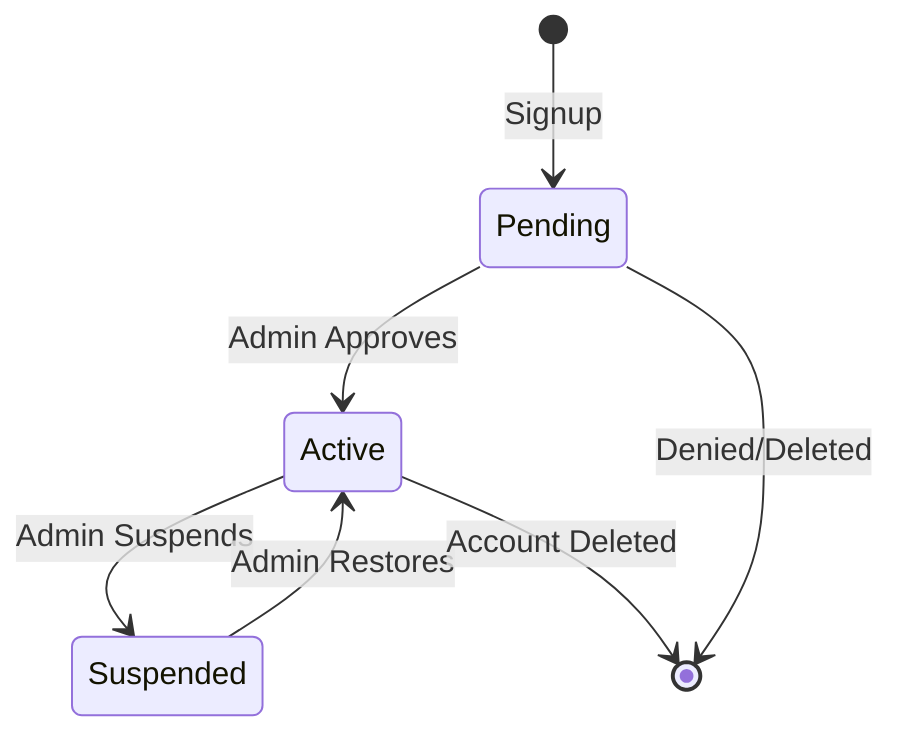
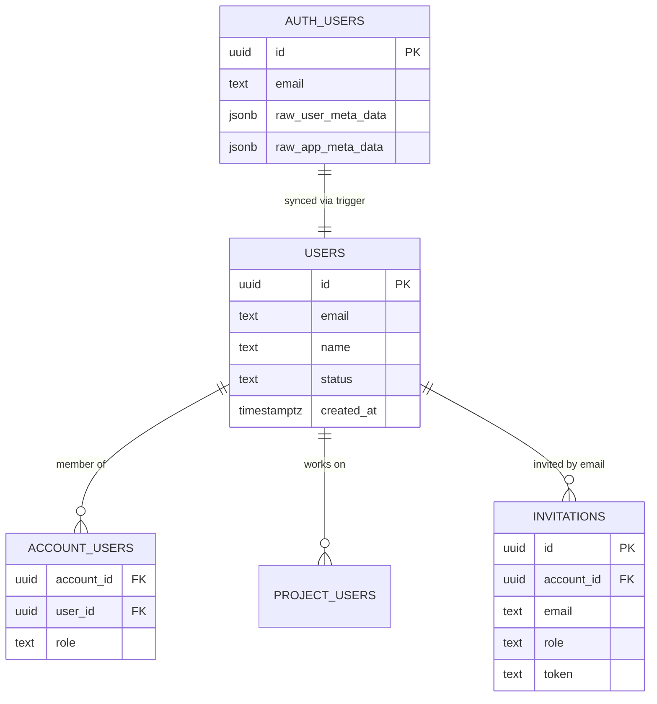
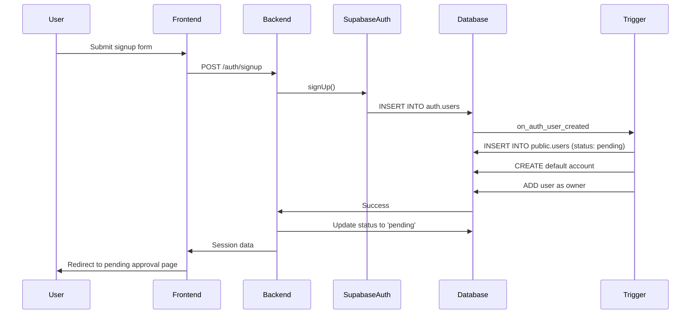
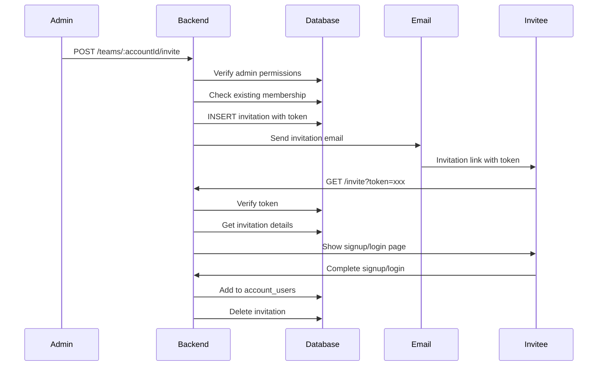

# User Management

> Status: Production-ready  
> Stack: Supabase Auth, PostgreSQL, NestJS, Next.js  
> Related Docs: [Authentication](./authentication-authorization.md), [Multi-Tenancy](./multi-tenancy.md), [Super Admin Panel](./super-admin-panel.md)

## Overview & Key Concepts

The scaffold provides comprehensive user management capabilities including user profiles, status workflows, role management, and a secure invitation system. Users are synchronized between Supabase Auth (`auth.users`) and the public users table (`public.users`) via database triggers.

### Key Concepts

- **User Profile**: Extended user data stored in `public.users` table
- **User Status**: Lifecycle state (active, pending, suspended)
- **Role Management**: System-wide roles (super_admin) and context-specific roles (account/project)
- **Invitation System**: Token-based secure invitations to join accounts
- **Profile Synchronization**: Automatic sync between auth.users and public.users

### User Lifecycle



---

## Architecture & How It Works

### User Data Model



### User Creation Flow



### Invitation Flow



---

## Implementation Details

### Directory Structure

```
backend/src/
├── users/
│   ├── users.module.ts
│   ├── users.controller.ts
│   ├── users.service.ts
│   ├── admin-users.controller.ts
│   └── user.enums.ts           # User roles enum
└── teams/
    ├── teams.controller.ts     # Invitation management
    └── teams.service.ts

frontend/src/
└── app/
    ├── admin/
    │   └── users/
    │       ├── page.tsx        # User list
    │       └── user-sheet.tsx  # User details
    └── dashboard/
        └── settings/
            └── team/
                ├── page.tsx              # Team members
                └── invitation-row.tsx    # Invitation management
```

### Key Files Walkthrough

#### 1. UsersService (`backend/src/users/users.service.ts`)

```typescript
@Injectable()
export class UsersService {
  async findAllUsers(page: number = 1, limit: number = 10, search?: string, status?: string) {
    const supabase = this.supabaseService.getAdminClient();
    const offset = (page - 1) * limit;

    let query = supabase
      .from('users')
      .select('*', { count: 'exact' });

    if (search) {
      query = query.or(`email.ilike.%${search}%,name.ilike.%${search}%`);
    }

    if (status) {
      query = query.eq('status', status);
    }

    const { data: users, count } = await query
      .range(offset, offset + limit - 1)
      .order('created_at', { ascending: false });

    // Add account count for each user
    const usersWithCounts = await Promise.all(users.map(async (user) => {
      const { count: accountsCount } = await supabase
        .from('account_users')
        .select('*', { count: 'exact', head: true })
        .eq('user_id', user.id);

      return {
        ...user,
        accountsCount: accountsCount || 0,
      };
    }));

    return { data: usersWithCounts, meta: { total: count, page, limit } };
  }

  async updateUserStatus(userId: string, status: string) {
    const allowed = ['active', 'pending', 'suspended'];
    if (!allowed.includes(status)) {
      throw new BadRequestException('Invalid status');
    }

    const supabase = this.supabaseService.getAdminClient();
    await supabase
      .from('users')
      .update({ status })
      .eq('id', userId);

    return { success: true };
  }

  async updateUserRole(userId: string, role: string) {
    const supabase = this.supabaseService.getAdminClient();

    // Update app_metadata in auth.users
    await supabase.auth.admin.updateUserById(userId, {
      app_metadata: { role },
    });

    return { success: true };
  }
}
```

#### 2. TeamsService - Invitation Management

```typescript
@Injectable()
export class TeamsService {
  async inviteUser(
    accountId: string,
    email: string,
    role: string,
    userId: string
  ) {
    const supabase = this.supabaseService.getClient();

    // Verify inviter is owner/admin
    await this.accessControlHelper.verifyAccountAccess(
      supabase,
      accountId,
      userId,
      ['owner', 'admin']
    );

    // Check if user already exists
    const { data: user } = await supabase
      .from('users')
      .select('id')
      .eq('email', email)
      .single();

    if (user) {
      // Check if already a member
      const { data: existingMember } = await supabase
        .from('account_users')
        .select('id')
        .eq('account_id', accountId)
        .eq('user_id', user.id)
        .single();

      if (existingMember) {
        throw new BadRequestException('User is already a member');
      }
    }

    // Check if invitation already exists
    const { data: existingInvite } = await supabase
      .from('invitations')
      .select('id')
      .eq('account_id', accountId)
      .eq('email', email)
      .single();

    if (existingInvite) {
      throw new ConflictException('Invitation already sent');
    }

    // Generate secure token
    const token = crypto.randomBytes(32).toString('hex');

    // Create invitation
    await supabase.from('invitations').insert({
      account_id: accountId,
      email,
      role,
      token,
    });

    // TODO: Send email via Resend
    console.log(`Invitation link: ${BASE_URL}/invite?token=${token}`);

    return { success: true };
  }

  async acceptInvitation(token: string, userId: string) {
    const supabase = this.supabaseService.getClient();

    // Verify token
    const { data: invitation } = await supabase
      .from('invitations')
      .select('*')
      .eq('token', token)
      .single();

    if (!invitation) {
      throw new NotFoundException('Invitation not found or expired');
    }

    // Verify user email matches invitation
    const { data: { user } } = await supabase.auth.getUser();
    if (user.email !== invitation.email) {
      throw new ForbiddenException('Invitation is for a different email');
    }

    // Add user to account
    await supabase.from('account_users').insert({
      account_id: invitation.account_id,
      user_id: userId,
      role: invitation.role,
    });

    // Delete invitation
    await supabase
      .from('invitations')
      .delete()
      .eq('id', invitation.id);

    return { success: true, accountId: invitation.account_id };
  }
}
```

#### 3. User Profile Sync Trigger

```sql
CREATE OR REPLACE FUNCTION handle_new_user()
RETURNS trigger AS $$
DECLARE
  new_account_id uuid;
BEGIN
  -- 1. Create user profile
  INSERT INTO public.users (id, email, name, status)
  VALUES (
    NEW.id, 
    NEW.email, 
    NEW.raw_user_meta_data->>'full_name',
    'pending'  -- Requires admin approval
  );

  -- 2. Create default account
  INSERT INTO public.accounts (name, owner_user_id)
  VALUES (
    COALESCE(NEW.raw_user_meta_data->>'full_name', 'My Account') || '''s Team',
    NEW.id
  )
  RETURNING id INTO new_account_id;

  -- 3. Add user as account owner
  INSERT INTO public.account_users (account_id, user_id, role)
  VALUES (new_account_id, NEW.id, 'owner');

  RETURN NEW;
END;
$$ LANGUAGE plpgsql SECURITY DEFINER;

CREATE TRIGGER on_auth_user_created
  AFTER INSERT ON auth.users
  FOR EACH ROW EXECUTE FUNCTION handle_new_user();
```

---

## API Reference

### Backend Endpoints

#### GET `/users/profile`
Get current user's profile.

**Headers:**
```
Authorization: Bearer <access_token>
```

**Response (200):**
```json
{
  "name": "John Doe",
  "email": "john@example.com",
  "avatar": "",
  "role": "member"
}
```

#### GET `/admin/users` (Admin Only)
List all users with pagination and filtering.

**Headers:**
```
Authorization: Bearer <access_token>
```

**Query Parameters:**
- `page` - Page number (default: 1)
- `limit` - Items per page (default: 10)
- `search` - Search by name or email
- `status` - Filter by status (active, pending, suspended)

**Response (200):**
```json
{
  "data": [
    {
      "id": "uuid",
      "email": "user@example.com",
      "name": "User Name",
      "status": "active",
      "accountsCount": 2,
      "created_at": "2024-01-01T00:00:00Z"
    }
  ],
  "meta": {
    "total": 50,
    "page": 1,
    "limit": 10,
    "totalPages": 5
  }
}
```

#### PATCH `/admin/users/:id/status` (Admin Only)
Update user status.

**Request Body:**
```json
{
  "status": "active" | "pending" | "suspended"
}
```

**Response (200):**
```json
{
  "success": true
}
```

#### PATCH `/admin/users/:id/role` (Admin Only)
Update user's system role.

**Request Body:**
```json
{
  "role": "super_admin" | "admin" | "user"
}
```

**Response (200):**
```json
{
  "success": true
}
```

#### POST `/teams/:accountId/invite`
Invite user to account (Owner/Admin only).

**Request Body:**
```json
{
  "email": "invitee@example.com",
  "role": "owner" | "admin" | "member"
}
```

**Response (201):**
```json
{
  "success": true
}
```

**Errors:**
- `400` - User already a member
- `403` - Insufficient permissions
- `409` - Invitation already sent

#### GET `/teams/:accountId/invitations`
List pending invitations for account.

**Response (200):**
```json
[
  {
    "id": "uuid",
    "email": "invitee@example.com",
    "role": "member",
    "created_at": "2024-01-01T00:00:00Z"
  }
]
```

#### DELETE `/teams/invitations/:id`
Revoke invitation.

**Response (200):**
```json
{
  "success": true
}
```

### Database Tables

#### `users` Table

```sql
CREATE TABLE users (
  id uuid PRIMARY KEY REFERENCES auth.users(id) ON DELETE CASCADE,
  email text NOT NULL UNIQUE,
  name text,
  status text CHECK (status IN ('active', 'pending', 'suspended')) DEFAULT 'pending',
  created_at timestamptz DEFAULT now()
);
```

#### `invitations` Table

```sql
CREATE TABLE invitations (
  id uuid PRIMARY KEY DEFAULT uuid_generate_v4(),
  account_id uuid REFERENCES accounts(id) ON DELETE CASCADE,
  email text NOT NULL,
  role text CHECK (role IN ('owner', 'admin', 'member')) NOT NULL,
  token text NOT NULL UNIQUE,
  created_at timestamptz DEFAULT now(),
  UNIQUE(account_id, email)
);
```

**RLS Policies:**
```sql
-- Account members can view invitations
CREATE POLICY "Members see account invitations" ON invitations
  FOR SELECT USING (
    account_id IN (SELECT get_auth_user_account_ids())
  );

-- Owners/admins can create invitations
CREATE POLICY "Owners/admins create invitations" ON invitations
  FOR INSERT WITH CHECK (
    EXISTS (
      SELECT 1 FROM account_users
      WHERE account_id = invitations.account_id
        AND user_id = auth.uid()
        AND role IN ('owner', 'admin')
    )
  );
```

---

## Configuration & Setup

### User Status Configuration

Default status workflow can be modified:

```typescript
// backend/src/auth/auth.service.ts
async signup(dto: SignupDto) {
  // Change default status here
  await admin.from('users').upsert({
    id: data.user.id,
    status: 'active',  // Change from 'pending' to auto-approve
  });
}
```

### Email Integration

To send actual invitation emails, integrate with Resend:

```typescript
// backend/src/teams/teams.service.ts
import { Resend } from 'resend';

const resend = new Resend(process.env.RESEND_API_KEY);

async inviteUser(accountId: string, email: string, role: string) {
  // ... create invitation ...

  // Send email
  await resend.emails.send({
    from: 'noreply@yourapp.com',
    to: email,
    subject: 'You've been invited to join a team',
    html: `
      <h1>Team Invitation</h1>
      <p>You've been invited to join a team.</p>
      <a href="${BASE_URL}/invite?token=${token}">Accept Invitation</a>
    `,
  });
}
```

---

## Best Practices & Patterns

### 1. Always Check User Status

✅ **Good**: Enforce status in AuthGuard
```typescript
// Already implemented in AuthGuard
const status = profile?.status || 'active';
if (status !== 'active') {
  throw new UnauthorizedException('Account not active');
}
```

### 2. Validate Invitation Tokens

✅ **Good**: Verify token and email match
```typescript
async acceptInvitation(token: string, userId: string) {
  const invitation = await this.getInvitation(token);
  const user = await this.getUser(userId);

  if (user.email !== invitation.email) {
    throw new ForbiddenException('Email mismatch');
  }

  // Add to account
}
```

### 3. Clean Up Expired Invitations

```sql
-- Run as cron job or background task
DELETE FROM invitations
WHERE created_at < NOW() - INTERVAL '7 days';
```

### 4. Prevent Duplicate Invitations

✅ **Good**: Check before creating
```typescript
const existing = await this.checkExistingInvitation(accountId, email);
if (existing) {
  throw new ConflictException('Already invited');
}
```

---

## Common Use Cases & Examples

### Use Case 1: Admin Approves Pending User

```typescript
// Frontend admin action
async function approveUser(userId: string) {
  await fetch(`${API_URL}/admin/users/${userId}/status`, {
    method: 'PATCH',
    headers: {
      'Authorization': `Bearer ${token}`,
      'Content-Type': 'application/json',
    },
    body: JSON.stringify({ status: 'active' }),
  });

  // Optionally send welcome email
  await sendWelcomeEmail(userId);
}
```

### Use Case 2: Invite Team Member

```typescript
// Frontend team settings
async function inviteMember(accountId: string, email: string, role: string) {
  const response = await fetch(`${API_URL}/teams/${accountId}/invite`, {
    method: 'POST',
    headers: {
      'Authorization': `Bearer ${token}`,
      'Content-Type': 'application/json',
    },
    body: JSON.stringify({ email, role }),
  });

  if (response.ok) {
    toast.success(`Invitation sent to ${email}`);
  } else {
    const error = await response.text();
    toast.error(error);
  }
}
```

### Use Case 3: Accept Invitation

```typescript
// Frontend invitation page
export default function InvitePage({ searchParams }: Props) {
  const token = searchParams.token;
  const [invitation, setInvitation] = useState(null);

  useEffect(() => {
    async function loadInvitation() {
      const res = await fetch(`${API_URL}/invitations/${token}`);
      setInvitation(await res.json());
    }
    loadInvitation();
  }, [token]);

  async function acceptInvitation() {
    const user = await getUser();
    
    await fetch(`${API_URL}/invitations/${token}/accept`, {
      method: 'POST',
      headers: {
        'Authorization': `Bearer ${user.access_token}`,
      },
    });

    redirect('/dashboard');
  }

  return (
    <div>
      <h1>Invitation to join {invitation?.accountName}</h1>
      <p>Role: {invitation?.role}</p>
      <Button onClick={acceptInvitation}>Accept</Button>
    </div>
  );
}
```

---

## Extension Guide

### Adding Custom User Fields

```sql
ALTER TABLE users
  ADD COLUMN phone text,
  ADD COLUMN company text,
  ADD COLUMN job_title text,
  ADD COLUMN avatar_url text;
```

### Adding User Preferences

```sql
CREATE TABLE user_preferences (
  user_id uuid PRIMARY KEY REFERENCES users(id) ON DELETE CASCADE,
  theme text DEFAULT 'system',
  language text DEFAULT 'en',
  notifications_enabled boolean DEFAULT true,
  email_digest text DEFAULT 'daily',
  preferences jsonb DEFAULT '{}'::jsonb
);
```

### Implementing User Roles Per Account

Already supported via `account_users.role`. To add more granular permissions:

```sql
CREATE TABLE role_permissions (
  id uuid PRIMARY KEY,
  role text NOT NULL,
  resource text NOT NULL,
  actions text[] NOT NULL,
  UNIQUE(role, resource)
);

INSERT INTO role_permissions (role, resource, actions) VALUES
  ('owner', 'projects', ARRAY['create', 'read', 'update', 'delete']),
  ('admin', 'projects', ARRAY['create', 'read', 'update']),
  ('member', 'projects', ARRAY['read']);
```

---

## Troubleshooting & FAQ

**Q: User signed up but can't log in**

A: Check user status. If 'pending', admin must approve:
```sql
UPDATE users SET status = 'active' WHERE email = 'user@example.com';
```

**Q: Invitation link doesn't work**

A: Verify token in database:
```sql
SELECT * FROM invitations WHERE token = 'token-here';
```

If expired or missing, recreate invitation.

**Q: How to bulk import users?**

A: Use Supabase Admin API:
```typescript
for (const user of users) {
  await supabase.auth.admin.createUser({
    email: user.email,
    password: generateRandomPassword(),
    email_confirm: true,
  });
}
```

**Q: Can users change their own status?**

A: No. Only admins can change user status via admin endpoints.

---

## Related Documentation

- [Authentication & Authorization](./authentication-authorization.md)
- [Multi-Tenancy](./multi-tenancy.md)
- [Super Admin Panel](./super-admin-panel.md)
- [Backend Architecture](./backend-architecture.md)
